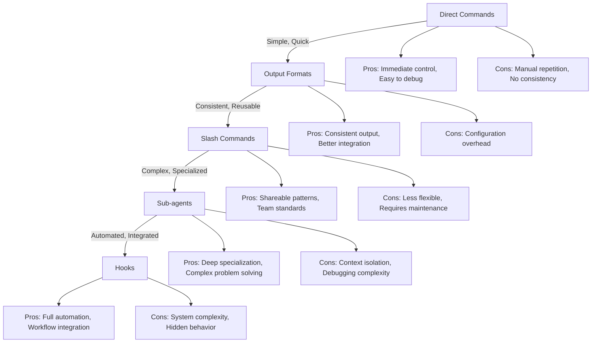
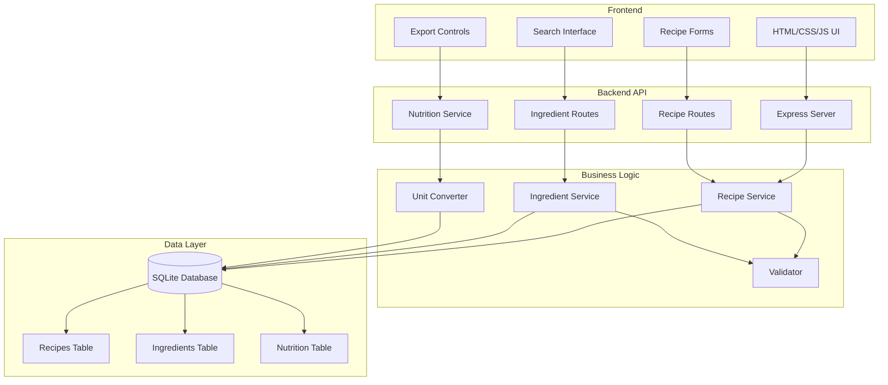
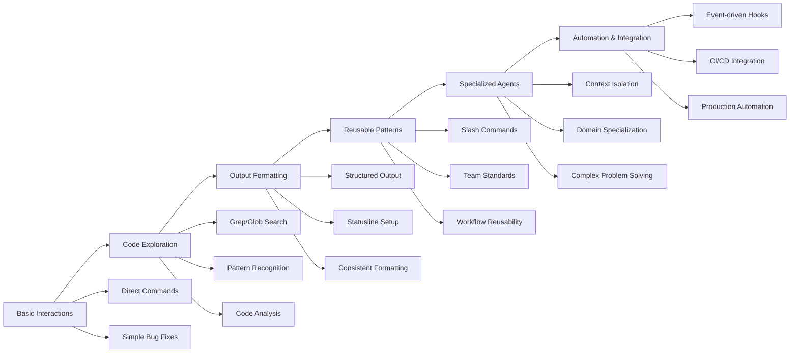

# Claude Code One-Day Practical Workshop

## Workshop Overview

### Target Audience
Developers new to agentic coding who want to learn how to leverage Claude Code for efficient, automated development workflows.

### Prerequisites
- Basic command line knowledge
- Programming experience (JavaScript/Node.js preferred)
- Laptop with Node.js installed
- Claude Code Pro/Max account

### Learning Objectives
By the end of this workshop, participants will be able to:
- Understand agentic coding concepts and Claude Code's capabilities
- Use Claude Code for daily development tasks
- Implement output formatting for better results
- Create reusable slash commands for common workflows
- Build specialized sub-agents for complex tasks
- Set up automation hooks for CI/CD integration
- Make informed decisions about when to use each approach

### Agenda

#### Morning Session (9:00 AM - 12:15 PM)

**Module 1: First Contact with Agentic Coding (60 min)**
- 9:00-9:15: What is agentic coding?
- 9:15-9:30: Setup Claude Code, authentication
- 9:30-9:45: Core concepts - tool use, file operations, command execution
- 9:45-10:00: **HANDS-ON**: First interaction - "Fix this bug", "Add this feature"

**Module 2: Working with Existing Code (45 min)**
- 10:00-10:15: **PROJECT INTRO**: Recipe Management System
- 10:15-10:30: Code exploration with Grep/Glob
- 10:45-11:00: **HANDS-ON**: Find and fix bugs in existing codebase
- 11:00-11:15: Break

**Module 3: Enhanced Control - Output Formats (45 min)**
- 11:15-11:30: Configuring output styles for better readability
- 11:30-11:45: Statusline setup for real-time feedback
- 11:45-12:00: **HANDS-ON**: Set up output formatting for recipe data
- 12:00-12:15: Benefits and limitations

#### Lunch (12:15-1:15)

#### Afternoon Session (1:15 PM - 5:15 PM)

**Module 4: Reusable Patterns - Slash Commands (60 min)**
- 1:15-1:30: Creating custom slash commands for common workflows
- 1:30-1:45: **HANDS-ON**: Build commands for Recipe System
- 1:45-2:00: Command organization and best practices
- 2:00-2:15: When to use commands vs direct interaction

**Module 5: Specialized Agents - Sub-agents (90 min)**
- 2:15-2:35: Sub-agents architecture and context isolation
- 2:35-2:55: **HANDS-ON**: Create production-grade sub-agents for Recipe System
- 2:55-3:15: Context engineering for sub-agents
- 3:15-3:30: **HANDS-ON**: Advanced scenarios
- 3:30-3:45: Trade-offs: complexity vs specialization

**Module 6: Automation - Hooks (60 min)**
- 3:45-4:00: Hook system and event-driven automation
- 4:00-4:15: **HANDS-ON**: Implement hooks for Recipe System
- 4:15-4:30: Hook chaining and complex workflows
- 4:30-4:45: Break

**Module 7: Integration & Optimization (30 min)**
- 4:45-5:00: **HANDS-ON**: Complete workflow - from recipe import to export
- 5:00-5:15: Real-world scenarios and Q&A

## The Power Curve: Understanding When to Use Each Approach



### Level 1: Direct Commands
**When**: Simple tasks, one-off changes, quick fixes
**Example**: "Fix the spelling error in the recipe title"
**Pros**: Immediate control, transparent, easy to debug
**Cons**: Manual repetition, no consistency

### Level 2: Output Formats
**When**: Team collaboration, standardized reporting
**Example**: Format all recipe exports consistently
**Pros**: Consistent output, better integration
**Cons**: Configuration overhead

### Level 3: Slash Commands
**When**: Repeated workflows, team standards
**Example**: `/validate-recipe` for all new recipes
**Pros**: Consistent execution, shareable patterns
**Cons**: Less flexible, requires maintenance

### Level 4: Sub-agents
**When**: Complex domains, specialized expertise needed
**Example**: Nutrition agent calculating complex dietary information
**Pros**: Deep specialization, complex problem solving
**Cons**: Context isolation, debugging complexity, potential conflicts

### Level 5: Hooks
**When**: Production automation, CI/CD integration
**Example**: Auto-validate recipes on commit, generate exports on build
**Pros**: Full automation, workflow integration
**Cons**: System complexity, hidden behavior, hard to debug

## Recipe Management System Project

### Domain Overview
A recipe management system that allows users to:
- Create, read, update, and delete recipes
- Search recipes by ingredients
- Calculate nutritional information
- Export recipes in different formats

### Key Features
- Recipe CRUD operations
- Ingredient management with unit conversion
- Nutritional calculation (calories, macros, allergens)
- Search and filtering capabilities
- Export to various formats (PDF, JSON, recipe cards)

### System Architecture


### Technical Stack
- Node.js/Express for backend
- SQLite for database
- Simple HTML/CSS/JS frontend
- Claude Code for development automation

## Key Learning Focus

### Learning Flow


### Context Engineering
- How to structure requests for optimal results
- Understanding Claude's capabilities and limitations
- Crafting effective prompts for different scenarios

### Progressive Complexity
- Start simple, add complexity only when needed
- Understanding the trade-offs at each level
- Making informed decisions about tool usage

### Production Reality
- Real-world scenarios vs toy examples
- Maintenance considerations
- Team collaboration aspects

### Trade-off Awareness
- When to use each approach
- Cost/benefit analysis of complexity
- Long-term maintainability vs short-term gains

## Workshop Materials Structure

```
workshop-materials/
├── README.md                          # This file
├── recipe-project/                    # Example project with bugs
│   ├── src/
│   ├── tests/
│   ├── package.json
│   └── server.js
├── modules/
│   ├── module1-intro/
│   ├── module2-existing-code/
│   ├── module3-output-formats/
│   ├── module4-slash-commands/
│   ├── module5-sub-agents/
│   ├── module6-hooks/
│   └── module7-integration/
├── exercises/
│   ├── solutions/
│   └── starter-code/
├── instructor-guide/
└── resources/
    ├── cheat-sheets/
    └── examples/
```

## Preparation Instructions

### For Participants
1. Install Node.js (v16 or higher)
2. Install Claude Code: `npm install -g @anthropic-ai/claude-code`
3. Set up Claude Code authentication
4. Clone or download workshop materials
5. Ensure Git is installed

### For Instructors
1. Review all modules and exercises
2. Test the Recipe Management System project
3. Prepare demo environments
4. Review exercise solutions
5. Prepare additional examples based on participant background

## Success Criteria

Participants will successfully complete the workshop if they can:
- Use Claude Code to modify existing code
- Create and use slash commands for common tasks
- Build specialized sub-agents for specific domains
- Implement hooks for workflow automation
- Explain the trade-offs between different approaches
- Apply context engineering principles effectively