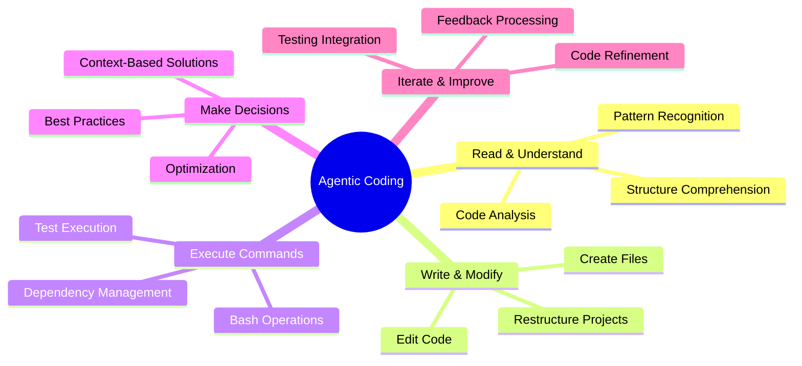
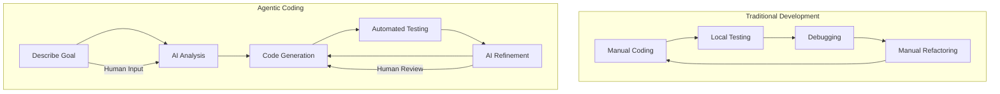
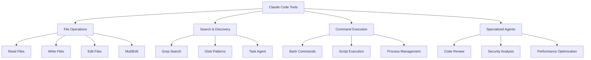
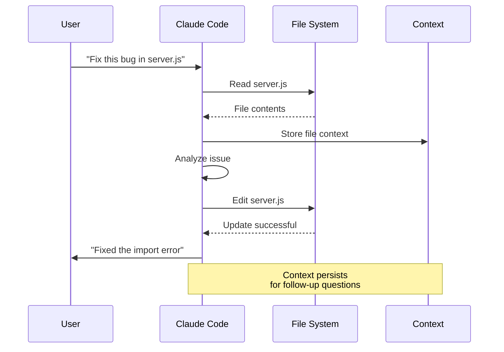
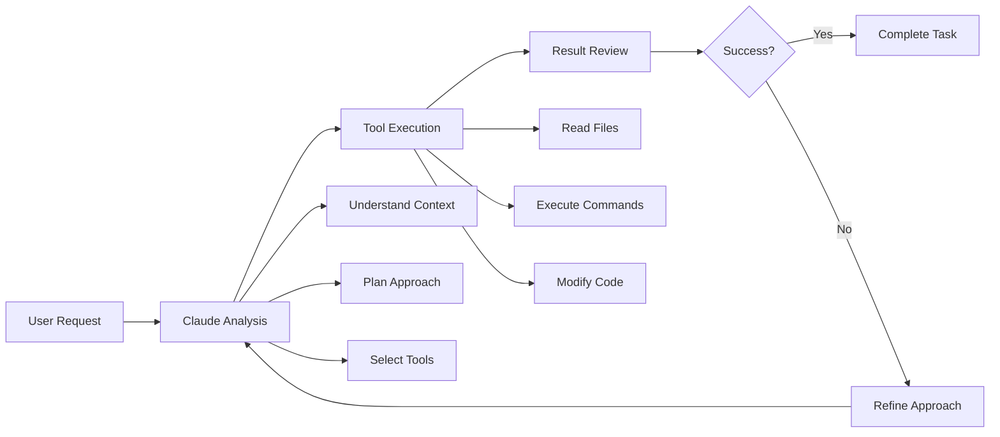

# Module 1: First Contact with Agentic Coding

## Learning Objectives
- Understand what agentic coding is and how it differs from traditional development
- Set up Claude Code and authenticate
- Learn basic Claude Code concepts and tool usage
- Make your first interactions with Claude Code

## What is Agentic Coding?

### Agentic Coding Capabilities


### Traditional Development vs Agentic Coding

**Traditional Development:**
```
Developer → Write Code → Test → Debug → Repeat
```

**Agentic Coding:**
```
Developer → Describe Goal → AI Agent → Analyze → Code → Test → Iterate → Result
```

### Development Workflow Comparison


## Claude Code Setup

### Installation
```bash
npm install -g @anthropic-ai/claude-code
```

### Authentication
1. Get Claude Code Pro/Max subscription
2. Run authentication command
3. Follow the setup prompts

### First Run
```bash
cd your-project
claude
```

## Core Concepts

### Claude Code Tools


### Tool Capabilities
- **Read** - Read file contents with syntax highlighting
- **Write** - Create new files with proper structure
- **Edit** - Modify existing files with precise changes
- **Bash** - Execute shell commands and capture output
- **Grep** - Search code with powerful regex patterns
- **Glob** - Find files by flexible pattern matching
- **Task** - Launch specialized agents for complex tasks

### Context Management


### Interactive Development Process


## Your First Interaction

### Exercise 1: Basic File Operations
1. Navigate to the recipe project
2. Start Claude Code
3. Ask it to read a file
4. Ask it to make a simple modification

### Example Prompts
```
"Read the server.js file and tell me what it does"
"What's the main entry point of this application?"
"Add a console.log statement to show when the server starts"
```

## Hands-on Exercise: Fix Basic Bugs

### Exercise 2: Fix Import Errors
The recipe project has some basic import and syntax errors. Use Claude Code to:

1. **Start the server and identify errors**
```bash
cd recipe-project
npm start
```

2. **Ask Claude Code to fix the errors**
```
"Fix the errors that are preventing the server from starting"
```

3. **Verify the fixes work**
```bash
npm start
```

### Exercise 3: Correct Route Definitions
1. **Test the API endpoints**
```bash
curl http://localhost:3000/api/recipes
```

2. **Identify issues with search functionality**
```
"Test the search endpoint and fix any issues"
```

## Key Takeaways

### Benefits of Agentic Coding
- **Speed**: Rapid prototyping and development
- **Consistency**: Automated code standards and patterns
- **Learning**: Real-time code review and suggestions
- **Productivity**: Focus on high-level problems, not implementation details

### Limitations
- **Context**: May miss project-specific knowledge
- **Quality**: Requires human review and testing
- **Security**: Need to be careful with sensitive information
- **Complexity**: May struggle with very complex business logic

### Best Practices
1. **Be specific** in your requests
2. **Review all code** before committing
3. **Test thoroughly** after modifications
4. **Iterate gradually** on complex changes
5. **Provide context** about your project and requirements

## Next Steps

After completing this module, you should:
- Have Claude Code set up and working
- Understand basic tool usage
- Be able to make simple code modifications
- Know how to ask effective questions

In the next module, we'll explore working with existing codebases and more complex modifications.