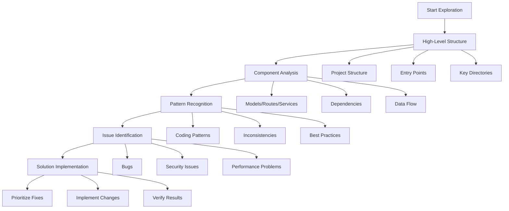
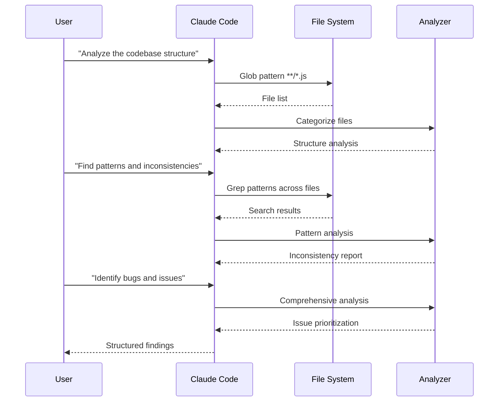
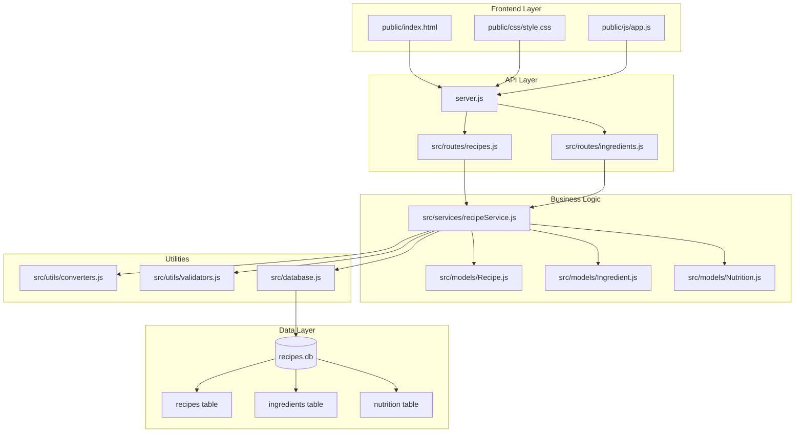
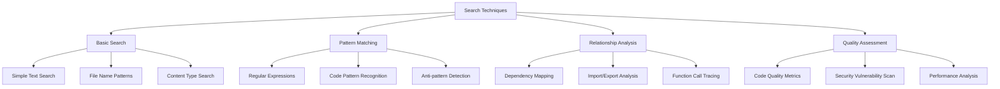
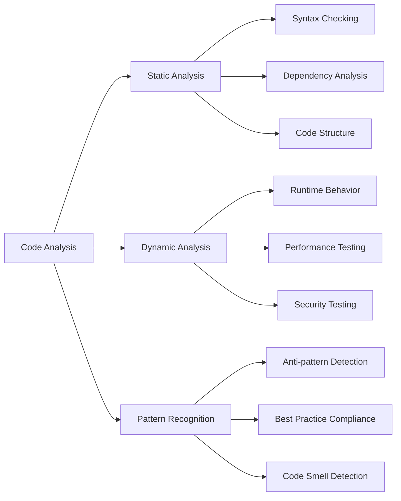

# Module 2: Working with Existing Code

## Learning Objectives
- Use Grep and Glob to explore and understand codebases
- Identify patterns and inconsistencies in existing code
- Navigate complex project structures
- Find and fix bugs in unfamiliar code
- Understand code relationships and dependencies

## Code Exploration Strategy

### Systematic Approach to Code Analysis


## Exploring Codebases with Claude Code

### Search Tools and Their Applications

**Grep** - Search for specific text patterns
```
"Find all files that contain 'recipe' in the src directory"
"Search for TODO comments in the codebase"
"Find all database queries in the project"
```

**Glob** - Find files by name patterns
```
"Find all JavaScript files in the project"
"Show me all test files"
"List all route files"
```

**Task** - Launch specialized search agents
```
"Search for security vulnerabilities in the code"
"Find performance issues in the database queries"
"Identify code that needs refactoring"
```

### Code Analysis Techniques

1. **Pattern Recognition**
   - Identify consistent coding patterns
   - Spot deviations from standards
   - Find repeated code that could be abstracted

2. **Dependency Analysis**
   - Understand how modules connect
   - Identify circular dependencies
   - Find unused imports or functions

3. **Bug Detection**
   - Look for common anti-patterns
   - Identify potential security issues
   - Find performance bottlenecks

### Code Analysis Workflow


## Recipe Project Code Analysis

### Current State Analysis

```mermaid
graph TD
    subgraph "Code Quality Issues"
        A1[Inconsistent Naming]
        A2[Missing Error Handling]
        A3[Security Vulnerabilities]
        A4[Performance Issues]
    end
    
    subgraph "Naming Issues"
        B1[prep_time vs prepTime]
        B2[Mixed Case Functions]
        B3[Inconsistent Variables]
    end
    
    subgraph "Error Handling"
        C1[API Endpoints]
        C2[Database Operations]
        C3[Frontend JavaScript]
    end
    
    subgraph "Security Issues"
        D1[SQL Injection]
        D2[Input Validation]
        D3[XSS Vulnerabilities]
    end
    
    subgraph "Performance Issues"
        E1[N+1 Queries]
        E2[Missing Indexes]
        E3[Inefficient Algorithms]
    end
    
    A1 --> B1
    A1 --> B2
    A1 --> B3
    A2 --> C1
    A2 --> C2
    A2 --> C3
    A3 --> D1
    A3 --> D2
    A3 --> D3
    A4 --> E1
    A4 --> E2
    A4 --> E3
```


### Current State
The recipe project has several issues that need to be identified and fixed:

1. **Inconsistent Naming Conventions**
   - Mix of `prep_time` and `prepTime`
   - Inconsistent variable naming
   - Mixed case in function names

2. **Missing Error Handling**
   - API endpoints without proper error handling
   - Database operations without try-catch
   - Frontend JavaScript errors

3. **Security Issues**
   - SQL injection vulnerabilities
   - Missing input validation
   - XSS vulnerabilities

4. **Performance Issues**
   - N+1 query problems
   - Missing database indexes
   - Inefficient algorithms

### Code Structure Analysis


## Hands-on Exercises

### Exercise 1: Code Exploration

**Objective**: Use search tools to understand the codebase structure.

**Tasks**:
1. **Find all route definitions**
```
"Use Grep to find all route definitions in the project"
```

2. **Identify database queries**
```
"Search for all database queries and categorize them by type"
```

3. **Find validation functions**
```
"Locate all validation functions in the codebase"
```

### Exercise 2: Identify Inconsistencies

**Objective**: Find and fix naming inconsistencies.

**Tasks**:
1. **Find mixed naming conventions**
```
"Search for inconsistent variable naming patterns"
```

2. **Standardize naming**
```
"Create a consistent naming convention and apply it throughout the codebase"
```

### Exercise 3: Bug Hunt

**Objective**: Identify and fix functional bugs.

**Tasks**:
1. **Find the search endpoint bug**
```
"The search by ingredient endpoint isn't working properly. Find and fix the issue"
```

2. **Fix the ingredient validation**
```
"Ingredient validation is not working correctly. Identify the issues and fix them"
```

3. **Fix the frontend JavaScript errors**
```
"The frontend has JavaScript errors that prevent proper functionality. Find and fix them"
```

## Code Analysis Patterns

### 1. Understanding Data Flow
```
"Trace how a recipe flows through the system from creation to display"
```

### 2. Identifying Refactoring Opportunities
```
"Find code that's repeated and could be extracted into reusable functions"
```

### 3. Security Analysis
```
"Search for potential security vulnerabilities in the code"
```

### 4. Performance Analysis
```
"Identify performance bottlenecks in the application"
```

## Advanced Search Techniques

### Search Pattern Hierarchy


### Using Regular Expressions
```
"Find all functions that don't have proper error handling"
"Search for SQL queries that might be vulnerable to injection"
"Find all console.log statements that should be removed"
```

### Cross-File Analysis
```
"Find where the Recipe model is used throughout the codebase"
"Identify all files that import the database module"
"Find circular dependencies in the code"
```

### Bug Detection Framework


### Code Quality Assessment
```
"Analyze the code for common JavaScript anti-patterns"
"Find functions that are too long and should be broken down"
"Identify missing error handling patterns"
```

## Best Practices

### 1. Systematic Exploration
- Start with high-level structure
- Drill down into specific areas
- Use multiple search techniques
- Document findings

### 2. Pattern Recognition
- Look for repeated code
- Identify inconsistent patterns
- Find deviations from standards
- Note areas for improvement

### 3. Iterative Improvement
- Fix one issue at a time
- Test after each change
- Document the changes
- Refine approach based on results

### 4. Context Understanding
- Understand the business domain
- Learn the technical stack
- Identify project conventions
- Consider maintenance implications

## Common Issues and Solutions

### Issue: Overwhelming Codebase
**Solution**: Break it down into manageable pieces
```
"Focus on one area at a time, starting with the routes"
```

### Issue: Unclear Dependencies
**Solution**: Map out the relationships
```
"Create a dependency map of the main modules"
```

### Issue: Inconsistent Patterns
**Solution**: Establish standards and apply them
```
"Standardize the error handling pattern across all routes"
```

## Next Steps

After completing this module, you should be able to:
- Effectively explore unfamiliar codebases
- Identify patterns and inconsistencies
- Find and fix bugs systematically
- Understand code relationships and dependencies
- Apply consistent coding standards

In the next module, we'll explore output formatting and how to make code more maintainable and readable.