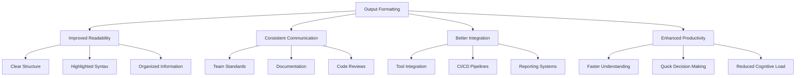
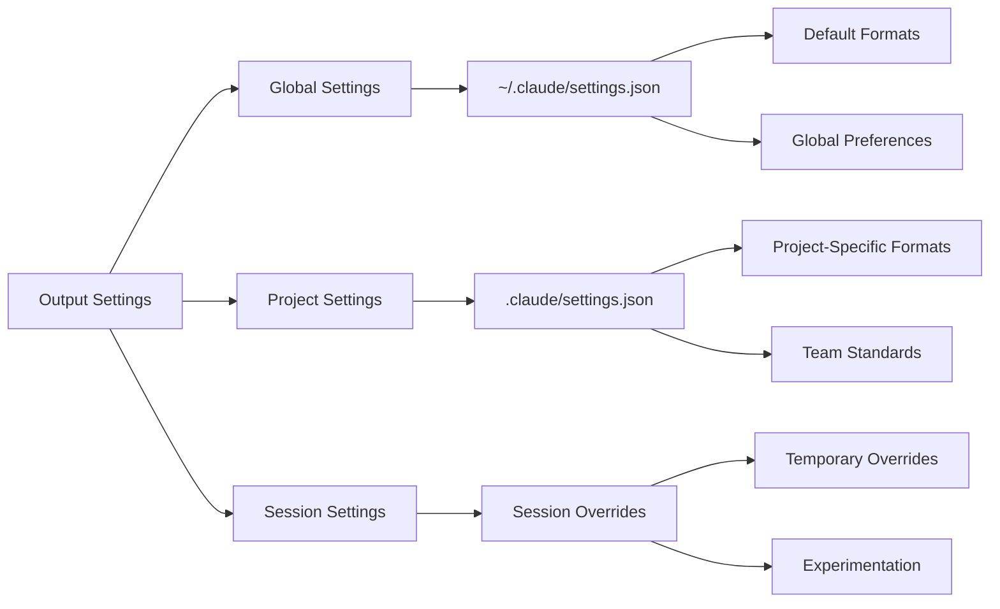
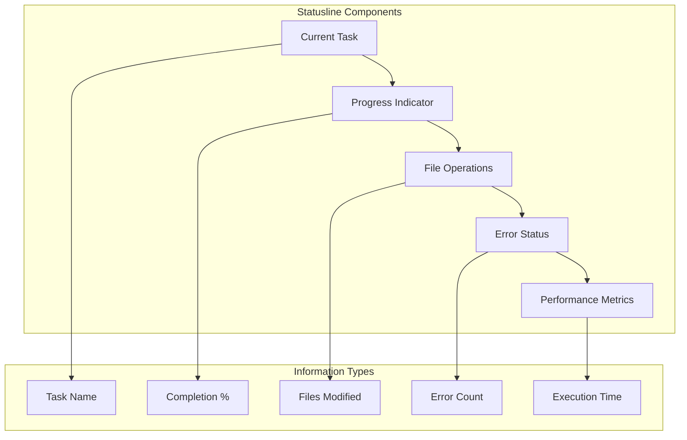
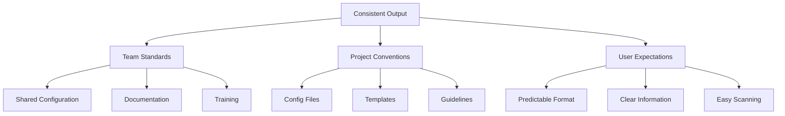
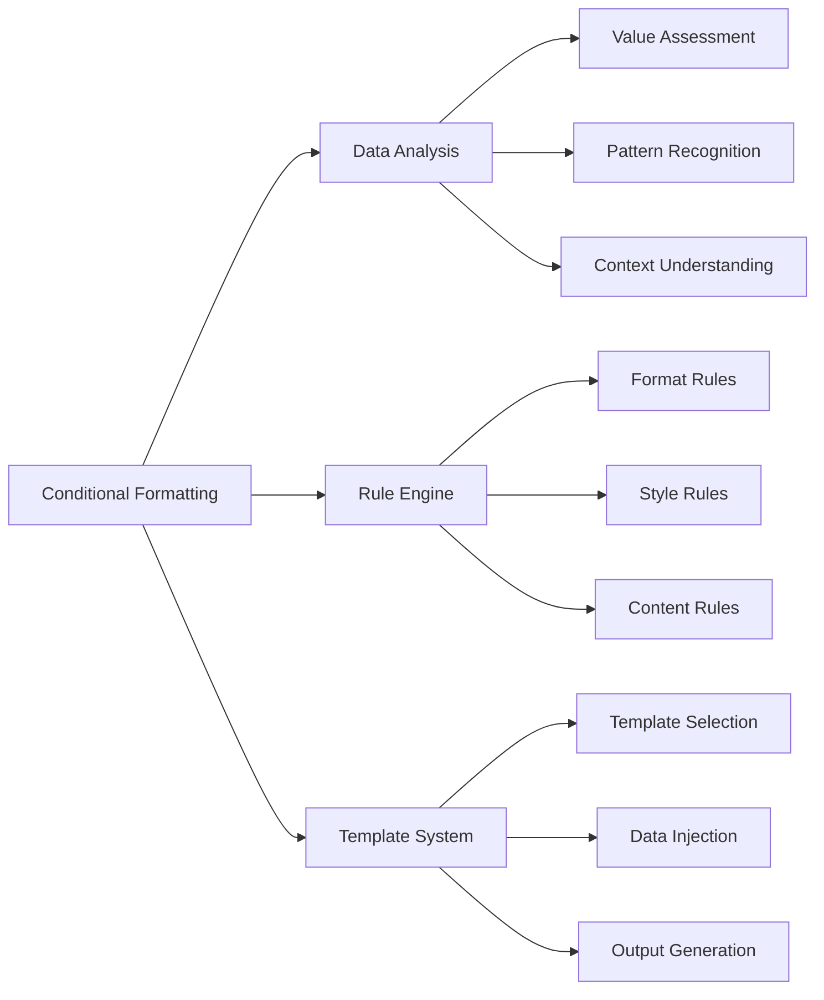

# Module 3: Enhanced Control - Output Formats

## Learning Objectives
- Understand Claude Code's output formatting capabilities
- Configure output styles for better readability
- Set up statusline for real-time feedback
- Create custom output formats for specific use cases
- Understand when and how to use different output formats

## Output Formatting Concepts

### Why Output Formatting Matters


### Types of Output Formats

1. **Structured Text Output**
   - JSON formatting
   - Table layouts
   - Code blocks with syntax highlighting
   - Hierarchical information display

2. **Visual Output**
   - Progress indicators
   - Status displays
   - Interactive elements
   - Color-coded information

3. **Machine-Readable Output**
   - Structured data formats
   - Log files
   - Integration outputs
   - Report generation

## Claude Code Output Configuration

### Settings Configuration


### Statusline Configuration
The statusline provides real-time feedback during development:



## Practical Configuration Examples

### Basic Output Format Configuration
```json
{
  "output": {
    "format": "structured",
    "style": "compact",
    "colors": true,
    "timestamps": true,
    "progress": true
  },
  "statusline": {
    "enabled": true,
    "position": "bottom",
    "show": ["task", "progress", "files", "errors"],
    "refresh_rate": 1000
  }
}
```

### Advanced Configuration for Recipe Project
```json
{
  "output": {
    "format": "detailed",
    "style": "recipe-themed",
    "colors": {
      "success": "#4CAF50",
      "error": "#f44336",
      "warning": "#ff9800",
      "info": "#2196F3"
    },
    "sections": {
      "recipe_analysis": {
        "show_nutrition": true,
        "show_ingredients": true,
        "format": "card"
      },
      "validation_results": {
        "show_errors": true,
        "show_warnings": true,
        "show_suggestions": true
      }
    }
  },
  "statusline": {
    "enabled": true,
    "theme": "culinary",
    "custom_indicators": {
      "cooking": "🍳",
      "analyzing": "🔍",
      "validating": "✅",
      "error": "❌"
    }
  }
}
```

## Hands-on Exercises

### Exercise 1: Basic Output Configuration
**Objective**: Set up basic output formatting for the recipe project.

**Tasks**:
1. **Create a basic configuration file**
```
"Create a .claude/settings.json file with basic output formatting"
```

2. **Test different output styles**
```
"Experiment with different output formats and see how they affect the display"
```

3. **Configure statusline**
```
"Enable and configure the statusline to show relevant information"
```

### Exercise 2: Custom Output Formats
**Objective**: Create custom output formats for recipe-specific data.

**Tasks**:
1. **Recipe analysis output**
```
"Create a custom output format for recipe analysis that shows nutrition information in a readable format"
```

2. **Validation results formatting**
```
"Design an output format for validation results that clearly shows errors, warnings, and suggestions"
```

3. **Ingredient list formatting**
```
"Create a formatted output for ingredient lists with unit conversions and allergen warnings"
```

### Exercise 3: Statusline Customization
**Objective**: Customize the statusline for recipe development workflow.

**Tasks**:
1. **Custom indicators**
```
"Add custom status indicators for recipe-specific tasks like ingredient validation, nutrition calculation, etc."
```

2. **Progress tracking**
```
"Configure the statusline to track progress through recipe development stages"
```

3. **Error monitoring**
```
"Set up statusline error monitoring for common recipe development issues"
```

## Output Format Best Practices

### 1. Consistency


### 2. Readability
- Use appropriate colors and formatting
- Structure information hierarchically
- Highlight important information
- Use consistent spacing and alignment

### 3. Performance
- Balance detail with performance
- Use progressive disclosure
- Cache expensive formatting operations
- Optimize for common use cases

### 4. Integration
- Design for tool integration
- Support machine-readable output
- Provide API access to formatted data
- Enable export capabilities

## Advanced Output Techniques

### 1. Conditional Formatting


### 2. Dynamic Output
- Adapt output based on context
- Change detail level based on user needs
- Provide interactive elements
- Support real-time updates

### 3. Export Capabilities
- Multiple export formats (JSON, CSV, PDF)
- Customizable export templates
- Batch export functionality
- Integration with external tools

## Troubleshooting Common Issues

### 1. Configuration Not Applied
**Solution**: Check configuration file locations and syntax

### 2. Performance Issues
**Solution**: Optimize formatting rules and reduce complexity

### 3. Inconsistent Output
**Solution**: Standardize configuration across environments

### 4. Statusline Not Working
**Solution**: Check terminal compatibility and settings

## Next Steps

After completing this module, you should be able to:
- Configure Claude Code output formats
- Set up and customize the statusline
- Create custom output formats for specific use cases
- Apply output formatting best practices
- Troubleshoot common configuration issues

In the next module, we'll explore slash commands and reusable patterns.