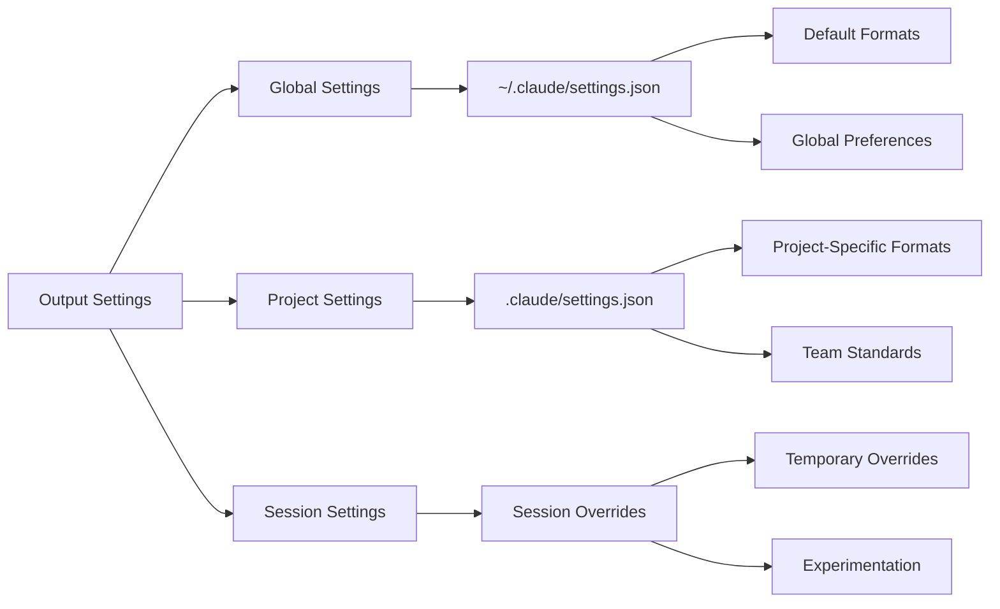
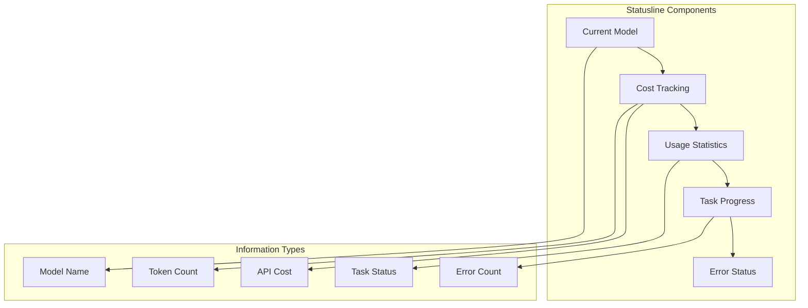
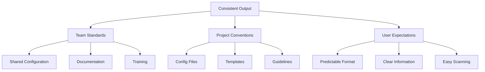

# Module 3: Enhanced Control - Output Formats

## Learning Objectives
- Understand Claude Code's output formatting capabilities
- Configure output styles for better readability
- Set up statusline for real-time feedback
- Create custom output formats for specific use cases
- Understand when and how to use different output formats

## Claude Code Output Configuration

### Settings Configuration
Claude Code uses JSON configuration files to control output formatting. Settings can be configured at different levels:



### Output Styles
Claude Code supports different output styles for formatting responses:

1. **Structured Output** - Organized, hierarchical information display
2. **Markdown** - Standard markdown formatting with headers, lists, and code blocks
3. **Code Blocks** - Syntax-highlighted code examples
4. **Compact** - Minimal, concise output format

### Statusline Configuration
The statusline provides real-time feedback during development and shows:



## Practical Configuration Examples

### Basic Output Format Configuration
```json
{
  "output": {
    "style": "structured",
    "format": "markdown",
    "code_blocks": true,
    "syntax_highlighting": true
  },
  "statusline": {
    "enabled": true,
    "show_model": true,
    "show_cost": true,
    "show_usage": true,
    "position": "bottom"
  }
}
```

### Advanced Configuration for Development Workflow
```json
{
  "output": {
    "style": "structured",
    "format": "markdown",
    "sections": {
      "code_review": {
        "show_diffs": true,
        "show_line_numbers": true,
        "syntax_highlighting": true
      },
      "test_results": {
        "show_pass_fail": true,
        "show_coverage": true,
        "format": "table"
      },
      "error_reports": {
        "show_stack_trace": true,
        "show_file_location": true,
        "format": "structured"
      }
    }
  },
  "statusline": {
    "enabled": true,
    "refresh_rate": 1000,
    "show": ["model", "cost", "usage", "task_progress"],
    "theme": "default"
  }
}
```

### Project-Specific Configuration
```json
{
  "output": {
    "style": "compact",
    "format": "markdown",
    "project_specific": {
      "api_endpoints": {
        "show_method": true,
        "show_endpoint": true,
        "show_status_codes": true
      },
      "database_operations": {
        "show_query": true,
        "show_execution_time": true,
        "show_affected_rows": true
      }
    }
  },
  "statusline": {
    "enabled": true,
    "custom_indicators": {
      "api_development": "🔌",
      "database_work": "🗄️",
      "testing": "🧪",
      "deployment": "🚀"
    }
  }
}
```

## Statusline Setup and Customization

### Basic Statusline
```json
{
  "statusline": {
    "enabled": true,
    "position": "bottom",
    "show": ["model", "cost", "usage"],
    "refresh_rate": 1000
  }
}
```

### Advanced Statusline with Custom Indicators
```json
{
  "statusline": {
    "enabled": true,
    "position": "bottom",
    "refresh_rate": 500,
    "show": ["model", "cost", "usage", "task_progress", "errors"],
    "custom_indicators": {
      "coding": "💻",
      "debugging": "🐛",
      "testing": "🧪",
      "deploying": "🚀",
      "reviewing": "👀",
      "documenting": "📝"
    },
    "color_scheme": {
      "success": "#4CAF50",
      "error": "#f44336",
      "warning": "#ff9800",
      "info": "#2196F3"
    }
  }
}
```

## Hands-on Exercises

### Exercise 1: Basic Output Configuration
**Objective**: Set up basic output formatting for your development workflow.

**Tasks**:
1. **Create a basic configuration file**
```bash
# Create .claude directory
mkdir -p .claude

# Create basic settings file
cat > .claude/settings.json << 'EOF'
{
  "output": {
    "style": "structured",
    "format": "markdown",
    "code_blocks": true,
    "syntax_highlighting": true
  },
  "statusline": {
    "enabled": true,
    "show_model": true,
    "show_cost": true,
    "show_usage": true,
    "position": "bottom"
  }
}
EOF
```

2. **Test different output styles**
```bash
# Test with a simple request
echo "Analyze this Python function and suggest improvements" > test_request.txt

# Try different configurations by modifying settings.json
# and observing the output differences
```

3. **Configure statusline**
```bash
# Enable statusline with custom indicators
cat > .claude/settings.json << 'EOF'
{
  "statusline": {
    "enabled": true,
    "refresh_rate": 1000,
    "show": ["model", "cost", "usage", "task_progress"],
    "custom_indicators": {
      "coding": "💻",
      "debugging": "🐛",
      "testing": "🧪"
    }
  }
}
EOF
```

### Exercise 2: Custom Output Formats
**Objective**: Create custom output formats for specific development tasks.

**Tasks**:
1. **Code review output format**
```json
{
  "output": {
    "style": "structured",
    "sections": {
      "code_review": {
        "show_diffs": true,
        "show_line_numbers": true,
        "highlight_changes": true,
        "format": "side_by_side"
      }
    }
  }
}
```

2. **Test results formatting**
```json
{
  "output": {
    "style": "structured",
    "sections": {
      "test_results": {
        "show_pass_fail": true,
        "show_coverage": true,
        "show_execution_time": true,
        "format": "table"
      }
    }
  }
}
```

3. **API documentation format**
```json
{
  "output": {
    "style": "structured",
    "sections": {
      "api_docs": {
        "show_method": true,
        "show_endpoint": true,
        "show_parameters": true,
        "show_response_format": true,
        "include_examples": true
      }
    }
  }
}
```

### Exercise 3: Statusline Customization
**Objective**: Customize the statusline for your specific development workflow.

**Tasks**:
1. **Development-focused statusline**
```json
{
  "statusline": {
    "enabled": true,
    "refresh_rate": 500,
    "show": ["model", "cost", "usage", "current_task", "file_count"],
    "custom_indicators": {
      "backend_dev": "⚙️",
      "frontend_dev": "🎨",
      "database_work": "🗄️",
      "api_work": "🔌",
      "testing": "🧪",
      "deployment": "🚀"
    }
  }
}
```

2. **Team collaboration statusline**
```json
{
  "statusline": {
    "enabled": true,
    "refresh_rate": 1000,
    "show": ["model", "cost", "usage", "team_tasks", "pull_requests"],
    "custom_indicators": {
      "code_review": "👀",
      "pull_request": "📤",
      "team_sync": "🤝",
      "deployment": "🚀",
      "meeting": "📅"
    }
  }
}
```

3. **Performance monitoring statusline**
```json
{
  "statusline": {
    "enabled": true,
    "refresh_rate": 2000,
    "show": ["model", "cost", "usage", "performance_metrics", "error_rate"],
    "custom_indicators": {
      "optimizing": "⚡",
      "profiling": "📊",
      "benchmarking": "⏱️",
      "memory_analysis": "🧠",
      "error_investigation": "🔍"
    }
  }
}
```

## Output Format Best Practices

### 1. Consistency


### 2. Readability
- Use appropriate formatting for the content type
- Structure information hierarchically
- Highlight important information
- Use consistent spacing and alignment

### 3. Performance
- Balance detail with performance
- Use appropriate refresh rates for statusline
- Cache expensive formatting operations
- Optimize for common use cases

### 4. Integration
- Design for tool integration
- Support machine-readable output when needed
- Provide API access to formatted data
- Enable export capabilities

## Advanced Output Techniques

### 1. Context-Aware Formatting
```json
{
  "output": {
    "style": "adaptive",
    "context_aware": {
      "file_type": {
        "python": {
          "show_type_hints": true,
          "show_docstrings": true,
          "format": "python_specific"
        },
        "javascript": {
          "show_types": true,
          "show_jsdoc": true,
          "format": "js_specific"
        }
      },
      "task_type": {
        "debugging": {
          "show_stack_trace": true,
          "show_error_context": true,
          "highlight_errors": true
        },
        "code_review": {
          "show_diffs": true,
          "show_metrics": true,
          "format": "review_specific"
        }
      }
    }
  }
}
```

### 2. Dynamic Output Adjustment
```json
{
  "output": {
    "style": "dynamic",
    "adaptive": {
      "screen_size": {
        "small": "compact",
        "medium": "structured",
        "large": "detailed"
      },
      "complexity": {
        "simple": "minimal",
        "moderate": "standard",
        "complex": "detailed"
      }
    }
  }
}
```

### 3. Multi-Format Output
```json
{
  "output": {
    "style": "multi_format",
    "formats": {
      "primary": "structured",
      "secondary": "json",
      "export_formats": ["markdown", "html", "pdf"]
    },
    "selection_criteria": {
      "interactive": "structured",
      "api": "json",
      "documentation": "markdown",
      "report": "pdf"
    }
  }
}
```

## Troubleshooting Common Issues

### 1. Configuration Not Applied
**Solution**: Check configuration file locations and syntax
```bash
# Verify configuration file exists
ls -la ~/.claude/settings.json
ls -la .claude/settings.json

# Validate JSON syntax
cat .claude/settings.json | python -m json.tool
```

### 2. Statusline Not Working
**Solution**: Check terminal compatibility and settings
```bash
# Verify terminal supports statusline
echo $TERM

# Check if statusline is enabled
cat .claude/settings.json | grep -A 10 "statusline"
```

### 3. Output Format Inconsistencies
**Solution**: Standardize configuration across environments
```bash
# Copy configuration to global location
cp .claude/settings.json ~/.claude/settings.json

# Verify configuration is loaded
claude-code --version
```

### 4. Performance Issues
**Solution**: Optimize formatting settings
```json
{
  "output": {
    "style": "compact",
    "statusline": {
      "refresh_rate": 2000,
      "show": ["model", "cost"]
    }
  }
}
```

## Integration with Other Tools

### 1. IDE Integration
```json
{
  "output": {
    "style": "structured",
    "ide_integration": {
      "vscode": {
        "format": "vscode_specific",
        "show_diagnostics": true,
        "show_quick_fixes": true
      },
      "intellij": {
        "format": "intellij_specific",
        "show_inspections": true,
        "show_intentions": true
      }
    }
  }
}
```

### 2. CI/CD Integration
```json
{
  "output": {
    "style": "structured",
    "cicd": {
      "github_actions": {
        "format": "github_specific",
        "show_step_status": true,
        "show_artifacts": true
      },
      "jenkins": {
        "format": "jenkins_specific",
        "show_build_status": true,
        "show_test_results": true
      }
    }
  }
}
```

### 3. Documentation Generation
```json
{
  "output": {
    "style": "structured",
    "documentation": {
      "auto_generate": true,
      "formats": ["markdown", "html"],
      "include_examples": true,
      "include_api_docs": true
    }
  }
}
```

## Next Steps

After completing this module, you should be able to:
- Configure Claude Code output formats
- Set up and customize the statusline
- Create custom output formats for specific use cases
- Apply output formatting best practices
- Troubleshoot common configuration issues

In the next module, we'll explore slash commands and reusable patterns.