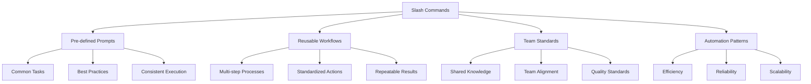
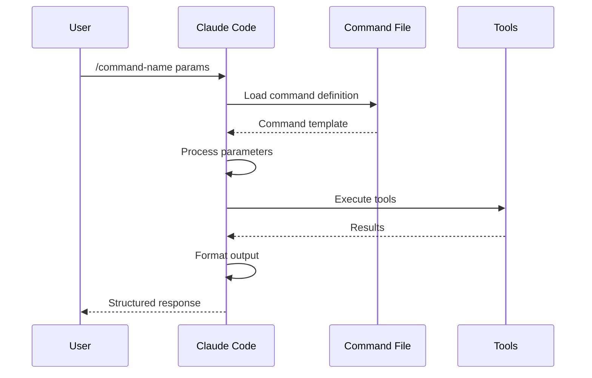
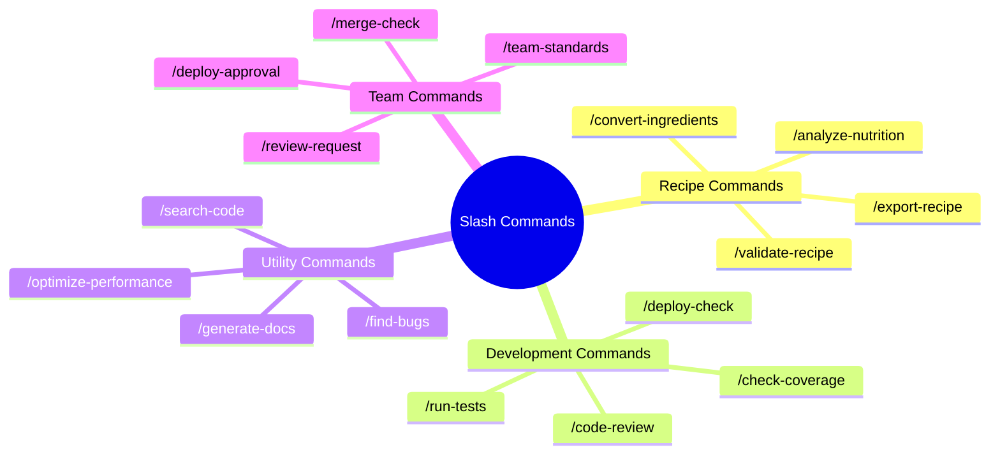
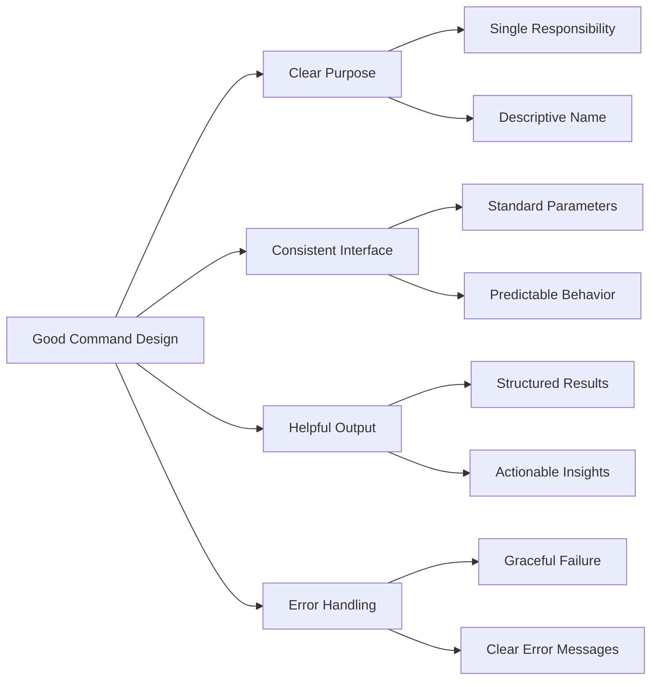
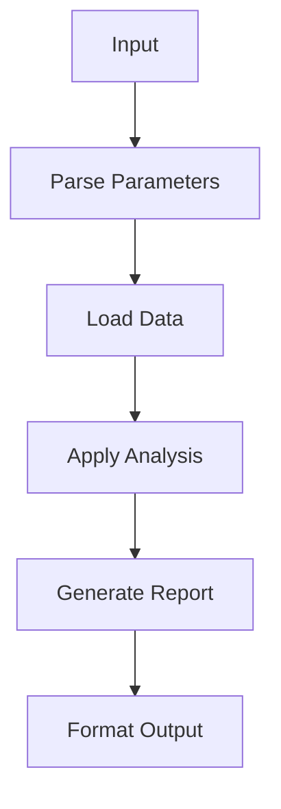
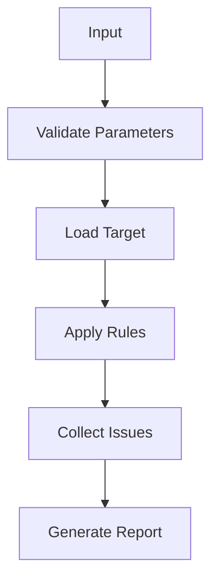
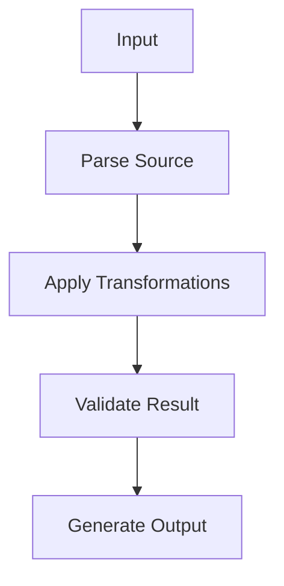

# Module 4: Reusable Patterns - Slash Commands

## Learning Objectives
- Understand the concept of slash commands in Claude Code
- Create custom slash commands for common workflows
- Organize and manage command libraries
- Implement best practices for command design
- Know when to use commands vs direct interaction

## Slash Commands Overview

### What are Slash Commands?


### Command Structure
```mermaid
graph LR
    A[Slash Command] --> B[Command Name]
    A --> C[Parameters]
    A --> D[Execution Logic]
    A --> E[Output Format]
    
    B --> B1[/command-name]
    B --> B1[Descriptive and clear]
    
    C --> C1[Required Params]
    C --> C2[Optional Params]
    C --> C3[Default Values]
    
    D --> D1[Task Definition]
    D --> D2[Tool Selection]
    D --> D3[Error Handling]
    
    E --> E1[Structured Output]
    E --> E2[Progress Feedback]
    E --> E3[Result Summary]
```

## Creating Slash Commands

### Command Creation Process


### Command File Structure
```
.claude/commands/
├── recipe-validation.md
├── nutrition-analysis.md
├── ingredient-converter.md
├── code-review.md
└── deployment-check.md
```

### Basic Command Template
```markdown
# Command Name: /validate-recipe

## Description
Validate a recipe for completeness, nutrition facts, and potential issues.

## Parameters
- recipe_id: ID of the recipe to validate (optional, uses current context if not provided)
- strict: Boolean for strict validation mode (default: false)
- include_suggestions: Boolean to include improvement suggestions (default: true)

## Execution Steps
1. Load recipe data from database
2. Validate required fields
3. Check nutrition calculations
4. Identify potential issues
5. Generate improvement suggestions
6. Format results for display

## Output Format
Validation results grouped by severity with actionable suggestions.
```

## Recipe-Specific Commands

### 1. Recipe Validation Command
```mermaid
graph TD
    A[/validate-recipe] --> B[Load Recipe]
    B --> C[Check Required Fields]
    C --> D[Validate Ingredients]
    D --> E[Calculate Nutrition]
    E --> F[Identify Issues]
    F --> G[Generate Suggestions]
    G --> H[Format Results]
    
    B --> B1[Title, Instructions]
    C --> C1[Non-empty fields]
    D --> D1[Quantities, Units]
    E --> E1[Per-serving values]
    F --> F1[Allergens, Health]
    G --> G1[Actionable items]
    H --> H1[Structured output]
```

### 2. Nutrition Analysis Command
```mermaid
graph TD
    A[/analyze-nutrition] --> B[Extract Ingredients]
    B --> C[Calculate Values]
    C --> D[Assess Health Score]
    D --> E[Identify Warnings]
    E --> F[Generate Report]
    
    B --> B1[Parse quantities]
    C --> C1[Use database]
    D --> D1[Score algorithm]
    E --> E1[Threshold checks]
    F --> F1[Visual format]
```

### 3. Ingredient Converter Command
```mermaid
graph TD
    A[/convert-ingredients] --> B[Parse Input]
    B --> C[Identify Units]
    C --> D[Apply Conversions]
    D --> E[Handle Allergens]
    E --> F[Generate Output]
    
    B --> B1[Extract values]
    C --> C1[Unit recognition]
    D --> D1[Conversion factors]
    E --> E1[Allergen detection]
    F --> F1[Multiple formats]
```

## Command Organization

### Command Categories


### Command Dependencies
```mermaid
graph TD
    A[/validate-recipe] --> B[/analyze-nutrition]
    A --> C[/convert-ingredients]
    B --> D[Ingredient Database]
    C --> D
    D --> E[Unit Conversion Factors]
    
    F[/code-review] --> G[/run-tests]
    G --> H[/check-coverage]
    H --> I[Test Results]
    
    J[/deploy-check] --> K[/code-review]
    J --> L[/run-tests]
    J --> M[/security-scan]
```

## Best Practices

### 1. Command Design Principles


### 2. Parameter Design
- Use clear, descriptive parameter names
- Provide sensible defaults
- Support both required and optional parameters
- Include parameter validation
- Document parameter types and constraints

### 3. Output Formatting
- Use consistent output structure
- Include progress indicators for long operations
- Provide clear success/failure feedback
- Support different output formats when appropriate
- Include next steps or follow-up actions

### 4. Error Handling
- Validate inputs before execution
- Provide helpful error messages
- Support graceful degradation
- Include recovery suggestions
- Log errors for debugging

## Hands-on Exercises

### Exercise 1: Create Basic Commands
**Objective**: Create fundamental slash commands for recipe management.

**Tasks**:
1. **Recipe validation command**
```
"Create a /validate-recipe command that checks recipe completeness and generates a report"
```

2. **Nutrition analysis command**
```
"Create a /analyze-nutrition command that calculates nutrition facts and health scores"
```

3. **Ingredient converter command**
```
"Create a /convert-ingredients command that handles unit conversions and allergen detection"
```

### Exercise 2: Advanced Command Features
**Objective**: Add advanced features to slash commands.

**Tasks**:
1. **Parameter validation**
```
"Add input validation and error handling to your commands"
```

2. **Progress tracking**
```
"Add progress indicators for long-running operations"
```

3. **Multiple output formats**
```
"Support different output formats (JSON, Markdown, Table) for your commands"
```

### Exercise 3: Command Integration
**Objective**: Create integrated command workflows.

**Tasks**:
1. **Command chaining**
```
"Create commands that can be chained together for complex workflows"
```

2. **Shared utilities**
```
"Extract common functionality into shared utilities that multiple commands can use"
```

3. **Workflow automation**
```
"Create a complete workflow command that orchestrates multiple smaller commands"
```

## Command Implementation Examples

### Example 1: Recipe Validation Command
```markdown
# Command: /validate-recipe

## Description
Validates a recipe for completeness, nutrition accuracy, and potential issues.

## Parameters
- recipe_id: ID of recipe to validate (optional)
- strict_mode: Enable strict validation (default: false)
- include_suggestions: Include improvement suggestions (default: true)

## Validation Checks
- Required fields present
- Ingredient quantities valid
- Nutrition calculations correct
- Allergen warnings
- Cooking time reasonable
- Serving sizes appropriate

## Output Format
Validation results with severity levels and actionable suggestions.
```

### Example 2: Code Review Command
```markdown
# Command: /code-review

## Description
Performs automated code review with focus on recipe project best practices.

## Parameters
- file_pattern: Pattern of files to review (default: src/**/*.js)
- strictness: Review strictness level (low, medium, high)
- include_security: Include security checks (default: true)

## Review Areas
- Code style and consistency
- Error handling
- Security vulnerabilities
- Performance issues
- Best practices compliance

## Output Format
Categorized findings with severity levels and specific recommendations.
```

## Common Command Patterns

### 1. Analysis Pattern


### 2. Validation Pattern


### 3. Transformation Pattern


## Performance Considerations

### 1. Command Execution
- Cache expensive operations
- Use incremental processing for large datasets
- Implement progress feedback
- Support cancellation of long operations

### 2. Resource Management
- Clean up temporary files
- Manage database connections
- Control memory usage
- Handle concurrent executions

### 3. User Experience
- Provide clear feedback
- Support interruptible operations
- Include estimated completion times
- Offer recovery options for failures

## Next Steps

After completing this module, you should be able to:
- Create effective slash commands for common workflows
- Organize and manage command libraries
- Implement best practices for command design
- Integrate commands into development workflows
- Understand when to use commands vs direct interaction

In the next module, we'll explore sub-agents and specialized expertise.