# Module 5: Specialized Agents - Sub-agents

## Learning Objectives
- Understand sub-agent architecture and context isolation
- Create specialized sub-agents for specific domains
- Implement context engineering for specialized agents
- Manage sub-agent lifecycle and communication
- Evaluate trade-offs of using sub-agents vs other approaches

## Sub-Agent Architecture

### What are Sub-agents?
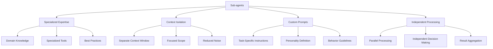

### Sub-Agent vs Main Agent Comparison
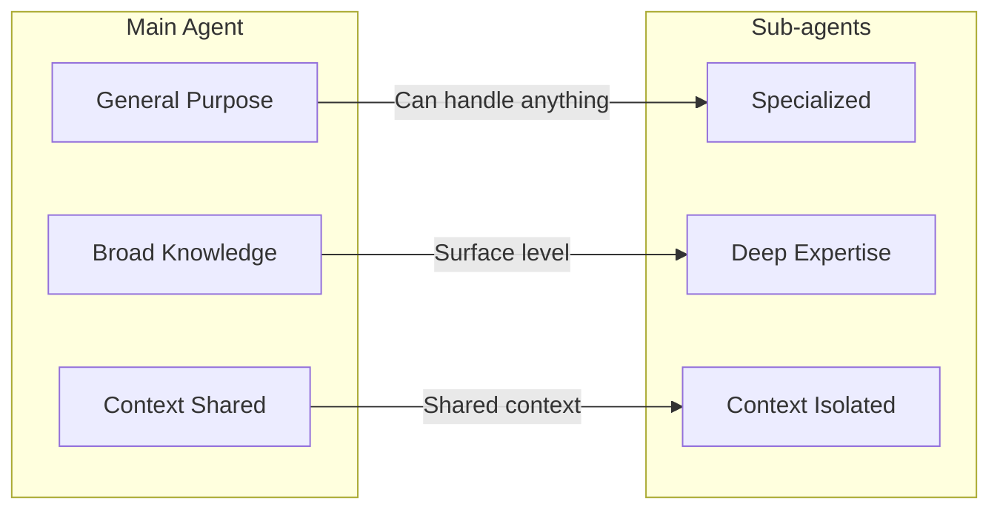

### Sub-Agent Communication Flow
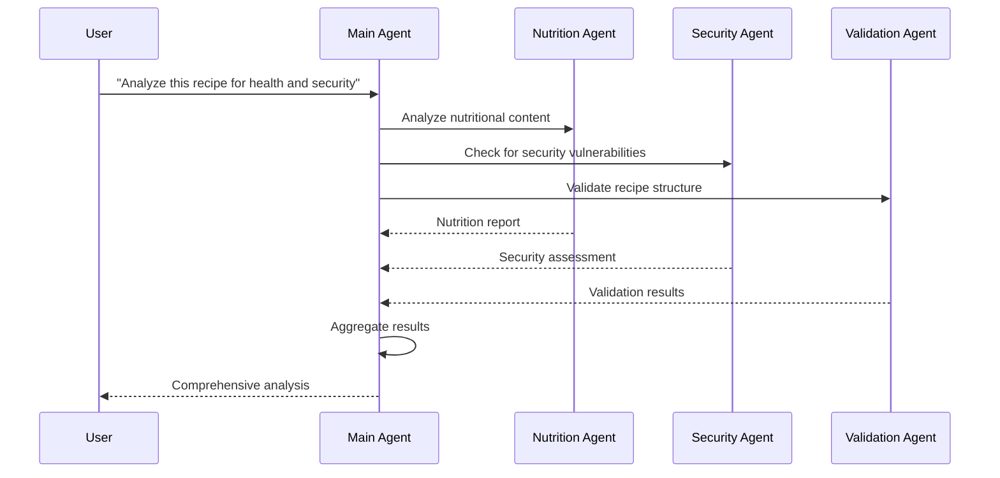

## Creating Specialized Sub-agents

### Sub-Agent Creation Process
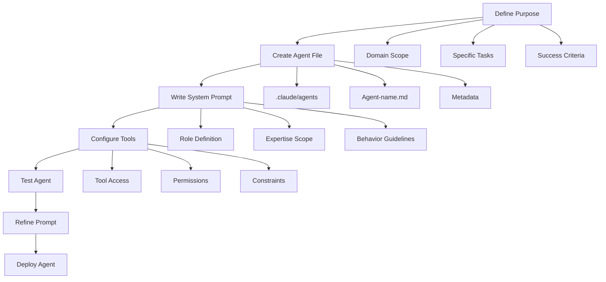

### Recipe Project Sub-agents

#### 1. Nutrition Analysis Agent
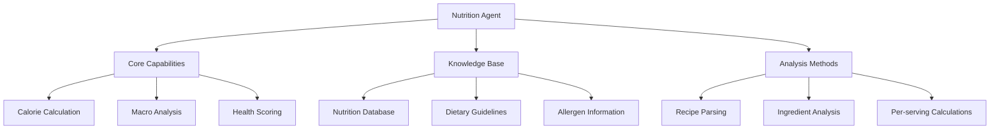

#### 2. Security Audit Agent
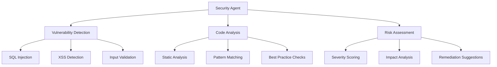

#### 3. Recipe Validation Agent
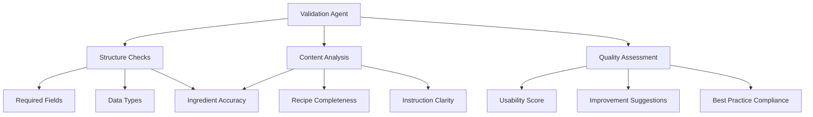

## Context Engineering for Sub-agents

### Context Isolation Benefits
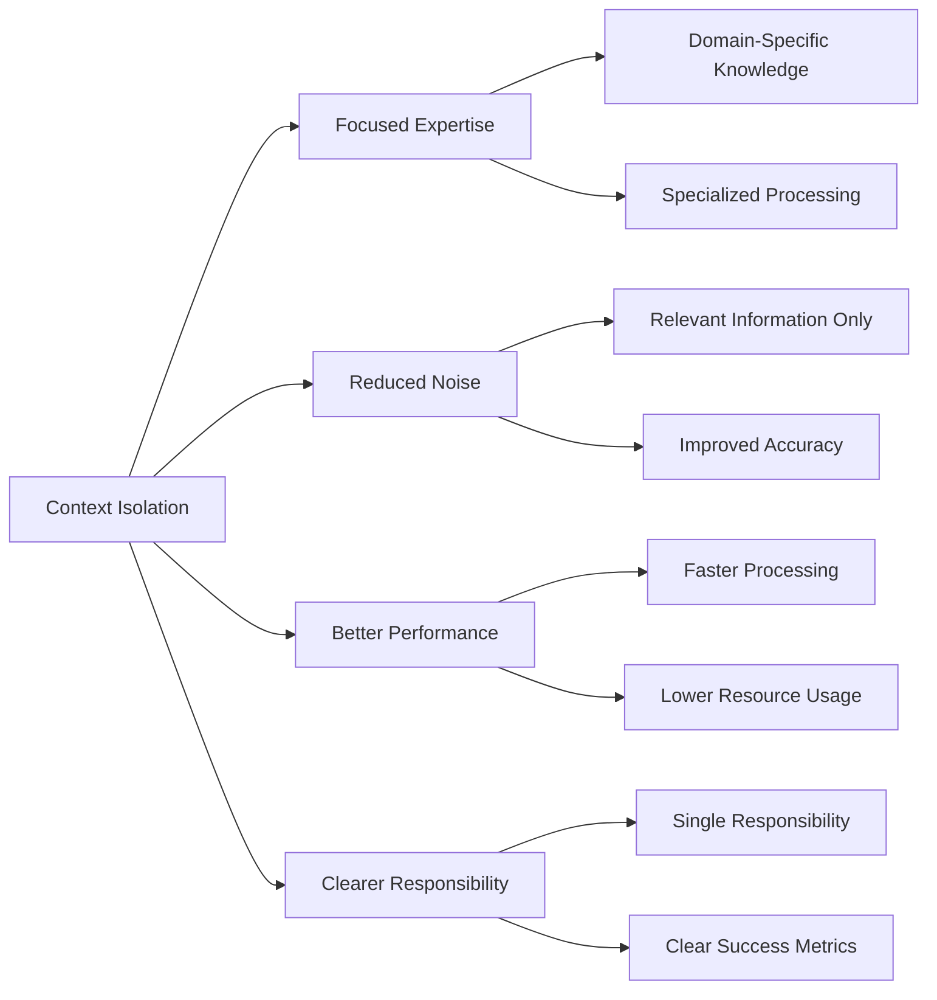

### Context Management Strategies
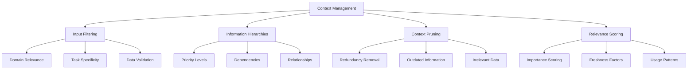

## Sub-Agent Implementation

### Agent File Structure
```
.claude/agents/
├── nutrition-analyst.md
├── security-auditor.md
├── recipe-validator.md
├── ingredient-expert.md
└── export-specialist.md
```

### Example: Nutrition Analyst Agent
```markdown
# Agent: Nutrition Analyst

## Role
You are a specialized nutrition analyst with expertise in recipe nutritional analysis, dietary guidelines, and health impact assessment.

## Expertise
- Nutritional science and dietetics
- Recipe analysis and calorie calculation
- Dietary restrictions and allergen identification
- Health impact assessment
- Nutritional database management

## Responsibilities
- Analyze recipe nutritional content
- Calculate per-serving nutrition facts
- Identify potential health concerns
- Suggest nutritional improvements
- Provide dietary compliance information

## Tools Available
- Recipe database access
- Nutritional information database
- Unit conversion utilities
- Calculation tools
- Report generation

## Guidelines
- Focus on accuracy in calculations
- Consider different dietary needs
- Provide actionable recommendations
- Flag potential allergens and health concerns
- Use evidence-based nutritional standards

## Output Format
Structured nutritional analysis with:
- Per-serving nutrition facts
- Health impact assessment
- Dietary compliance information
- Improvement suggestions
- Allergen warnings
```

## Sub-Agent Coordination

### Agent Orchestration
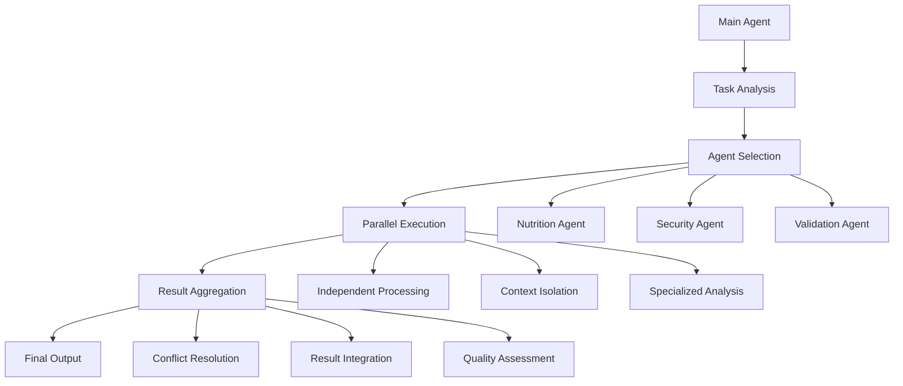

### Communication Patterns
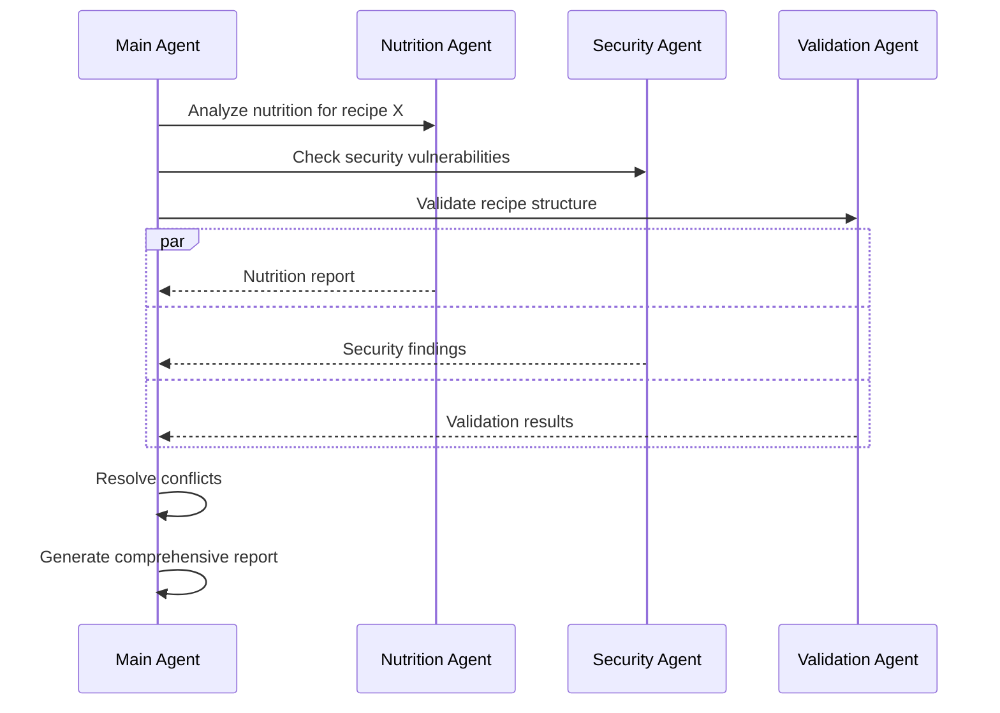

## Hands-on Exercises

### Exercise 1: Create Nutrition Analysis Agent
**Objective**: Build a specialized agent for nutritional analysis.

**Tasks**:
1. **Define agent scope**
```
"Create a nutrition analysis agent that can calculate calories, macros, and health scores for recipes"
```

2. **Implement core functionality**
```
"Implement nutritional calculation logic using the ingredient database and conversion utilities"
```

3. **Test agent accuracy**
```
"Test the agent with known recipes and verify the accuracy of nutritional calculations"
```

### Exercise 2: Security Audit Agent
**Objective**: Create a security-focused sub-agent.

**Tasks**:
1. **Security expertise definition**
```
"Define the security knowledge base and vulnerability detection capabilities"
```

2. **Code analysis implementation**
```
"Implement static code analysis for common security vulnerabilities in the recipe project"
```

3. **Risk assessment system**
```
"Create a risk scoring system for security findings with remediation suggestions"
```

### Exercise 3: Multi-Agent Coordination
**Objective**: Coordinate multiple sub-agents for complex analysis.

**Tasks**:
1. **Agent communication**
```
"Set up communication protocols between nutrition, security, and validation agents"
```

2. **Result integration**
```
"Implement result aggregation and conflict resolution between different agent findings"
```

3. **Workflow orchestration**
```
"Create a main agent that can orchestrate multiple sub-agents for comprehensive recipe analysis"
```

## Trade-offs and Considerations

### Benefits of Sub-agents
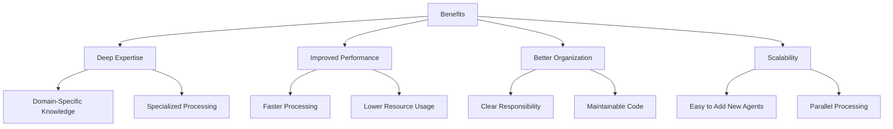

### Challenges and Limitations
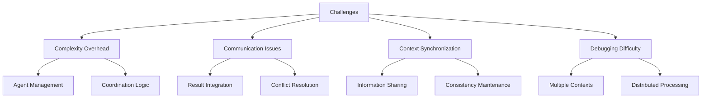

### When to Use Sub-agents
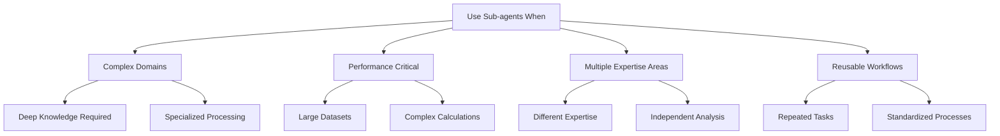

## Best Practices

### 1. Agent Design
- Keep agents focused on specific domains
- Define clear boundaries and responsibilities
- Provide comprehensive system prompts
- Include proper error handling

### 2. Context Management
- Isolate relevant information
- Use efficient data structures
- Implement context pruning
- Monitor context window usage

### 3. Communication
- Standardize message formats
- Implement proper error handling
- Use asynchronous processing
- Provide progress feedback

### 4. Testing and Validation
- Test agents independently
- Validate communication protocols
- Monitor performance metrics
- Establish success criteria

## Next Steps

After completing this module, you should be able to:
- Design and implement specialized sub-agents
- Manage context isolation and communication
- Coordinate multiple agents for complex tasks
- Evaluate when to use sub-agents vs other approaches
- Implement best practices for agent development

In the next module, we'll explore hooks and automation patterns.