# Module 6: Automation - Hooks

## Learning Objectives
- Understand hook systems and event-driven automation
- Implement hooks for various development workflows
- Configure hook chaining and complex automation
- Manage hook lifecycle and error handling
- Evaluate when to use hooks vs other automation approaches

## Hook System Overview

### What are Hooks?
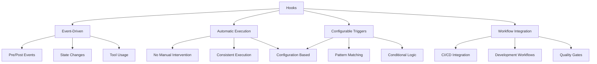

### Hook Architecture
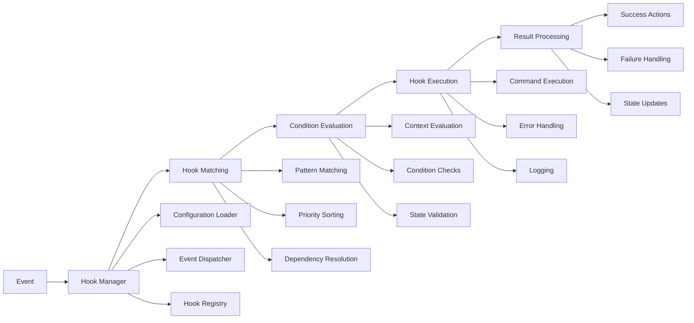

### Hook Lifecycle
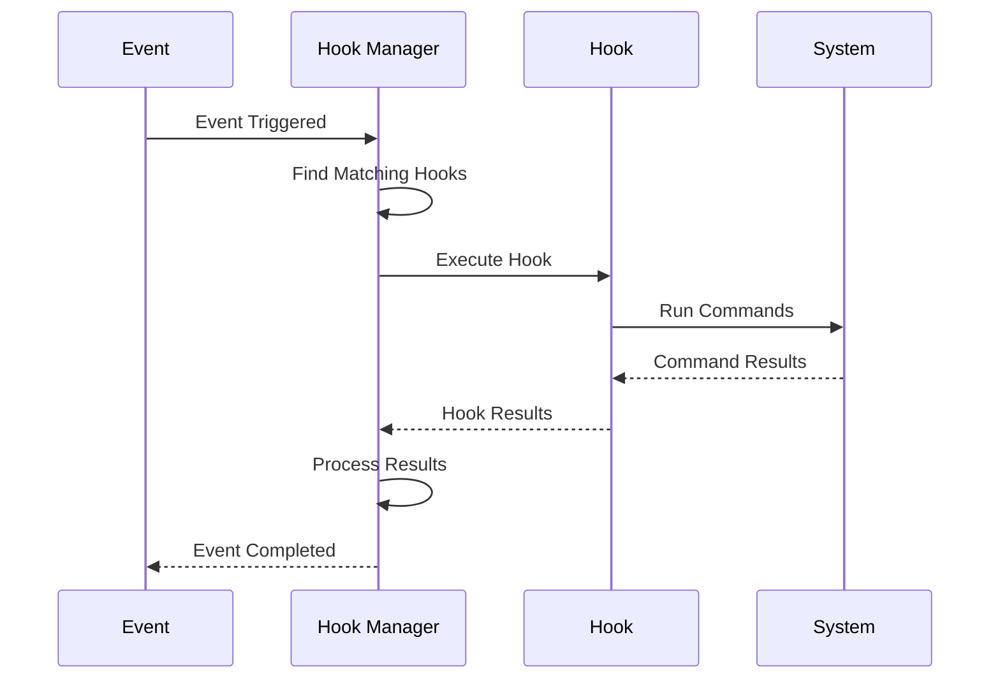

## Types of Hooks

### 1. Tool-based Hooks
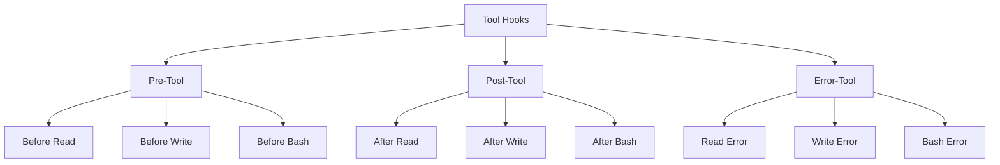

### 2. Event-based Hooks
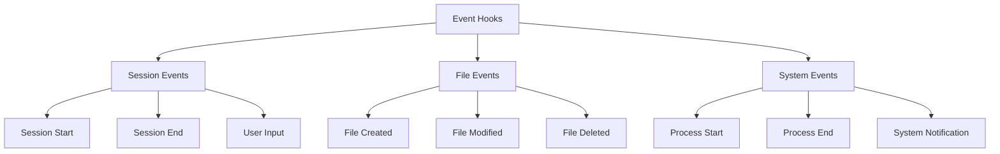

### 3. Workflow Hooks
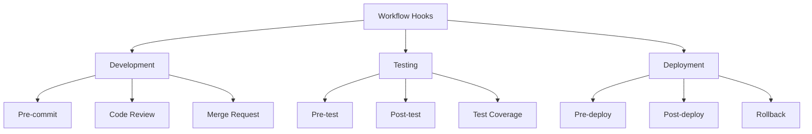

## Hook Configuration

### Configuration Structure
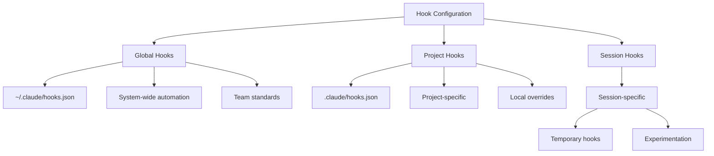

### Basic Hook Example
```json
{
  "hooks": {
    "pre-write": {
      "match": "**/*.js",
      "run": "npm run lint",
      "condition": "file_changed && file_size < 1000000"
    },
    "post-bash": {
      "match": "npm test",
      "run": "npm run coverage",
      "condition": "exit_code == 0"
    }
  }
}
```

### Advanced Hook Configuration
```json
{
  "hooks": {
    "pre-commit": {
      "match": "**/*",
      "run": [
        "npm run lint",
        "npm run test",
        "npm run security-check"
      ],
      "condition": "staged_files.length > 0",
      "parallel": true,
      "timeout": 30000,
      "on_error": "fail"
    },
    "post-write": {
      "match": "src/**/*.js",
      "run": "npm run build",
      "condition": "file_changed && !file_name.includes('test')",
      "environment": {
        "NODE_ENV": "production"
      }
    }
  }
}
```

## Recipe Project Hook Examples

### 1. Pre-commit Validation Hooks
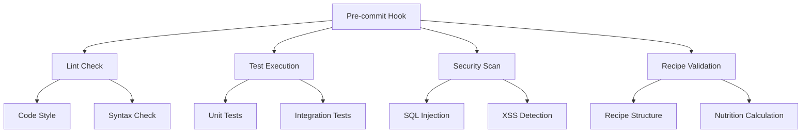

### 2. Build Automation Hooks
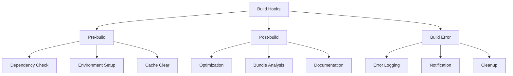

### 3. Deployment Safety Hooks
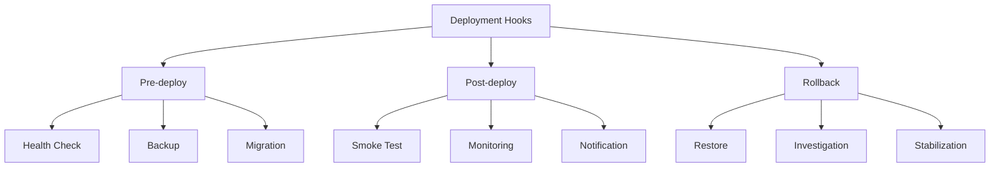

## Hook Implementation

### Hook Manager Architecture
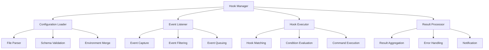

### Hook Execution Flow
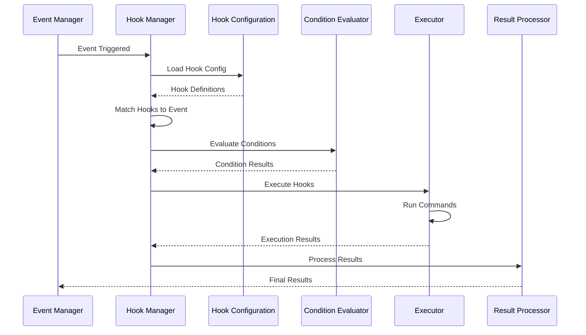

## Hands-on Exercises

### Exercise 1: Basic Hook Setup
**Objective**: Set up basic hooks for recipe project development.

**Tasks**:
1. **Create hook configuration file**
```
"Create a .claude/hooks.json file with basic pre-commit and post-write hooks"
```

2. **Implement linting hook**
```
"Add a pre-commit hook that runs ESLint on JavaScript files"
```

3. **Add test execution hook**
```
"Create a hook that runs tests automatically when test files change"
```

### Exercise 2: Recipe-Specific Hooks
**Objective**: Create hooks tailored for recipe development workflows.

**Tasks**:
1. **Recipe validation hook**
```
"Create a hook that validates recipe structure when recipe files are modified"
```

2. **Nutrition calculation hook**
```
"Implement a hook that automatically calculates nutrition when ingredients change"
```

3. **Allergen detection hook**
```
"Add a hook that scans for allergens when new ingredients are added"
```

### Exercise 3: Advanced Hook Chaining
**Objective**: Implement complex hook workflows with chaining.

**Tasks**:
1. **Build automation chain**
```
"Create a chain of hooks for build automation: lint → test → build → optimize"
```

2. **Deployment safety chain**
```
"Implement deployment safety hooks: backup → health check → deploy → smoke test"
```

3. **Error handling chain**
```
"Add comprehensive error handling with rollback capabilities"
```

### Exercise 4: Hook Performance Optimization
**Objective**: Optimize hook performance for large projects.

**Tasks**:
1. **Parallel execution**
```
"Configure hooks to run in parallel where possible"
```

2. **Conditional execution**
```
"Implement smart conditions to avoid unnecessary hook execution"
```

3. **Caching and optimization**
```
"Add caching for expensive hook operations"
```

## Hook Best Practices

### 1. Configuration Management
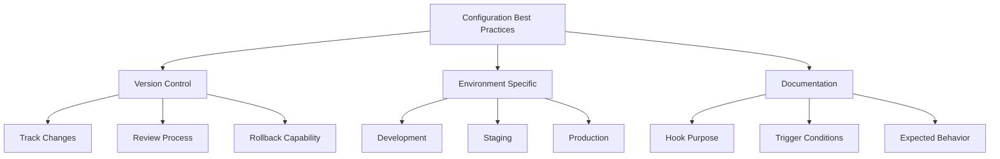

### 2. Performance Optimization
- Use parallel execution when possible
- Implement smart condition checking
- Cache expensive operations
- Monitor and optimize execution time

### 3. Error Handling
- Graceful degradation for non-critical hooks
- Clear error messages and logging
- Rollback capabilities for destructive operations
- Notification systems for important events

### 4. Security Considerations
- Validate hook configurations
- Restrict command execution permissions
- Audit hook execution logs
- Implement rate limiting for resource-intensive operations

## Hook Patterns and Anti-patterns

### Good Patterns
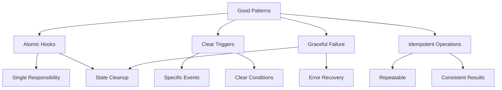

### Anti-patterns
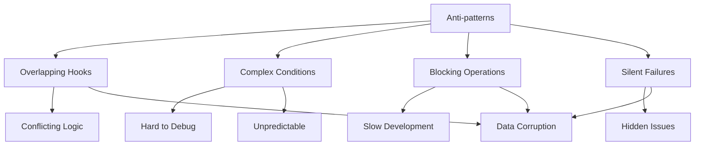

## Monitoring and Debugging

### Hook Monitoring
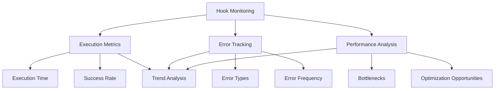

### Debugging Techniques
- Enable verbose logging for hook execution
- Use dry-run mode for testing
- Implement hook execution tracing
- Create test scenarios for validation

## Next Steps

After completing this module, you should be able to:
- Configure hooks for various development workflows
- Implement hook chaining and complex automation
- Manage hook lifecycle and error handling
- Optimize hook performance and reliability
- Evaluate when to use hooks vs other approaches

In the final module, we'll explore integration and real-world scenarios.