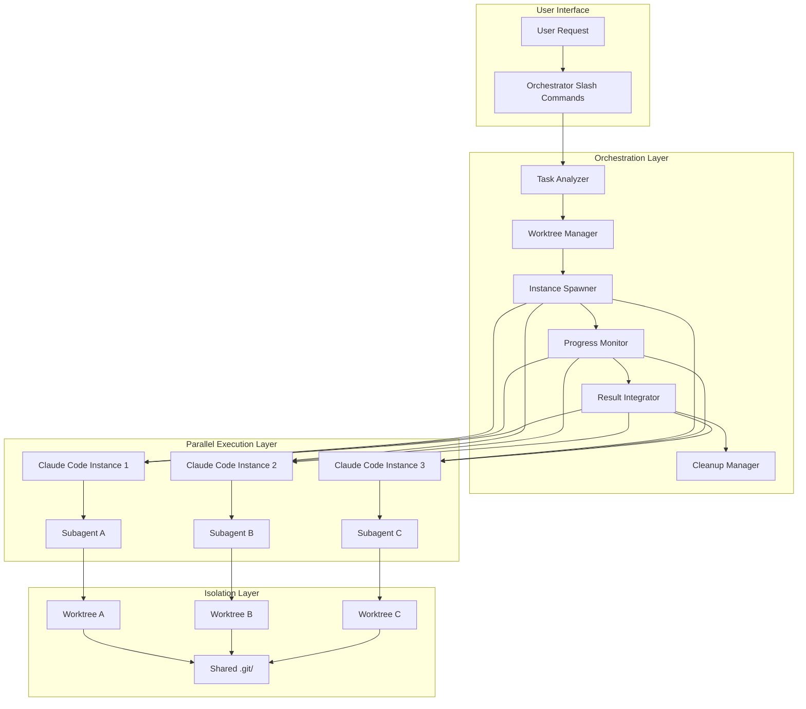

# Module 7: Automated Parallel Development Orchestration

## Learning Objectives
- Build automated orchestration systems that hide worktree complexity
- Create slash commands that spawn parallel Claude Code instances automatically
- Design subagent workflows that coordinate across multiple worktrees
- Implement hooks for automatic merging and cleanup
- Develop user-friendly interfaces for parallel development

## Module Overview

This advanced module teaches you how to build **orchestration systems** that completely hide the complexity of git worktrees and manual instance management. Users will simply express what they want to accomplish, and your orchestrator will:

1. **Automatically create worktrees** for parallel tasks
2. **Spawn Claude Code subprocesses** to work in each worktree  
3. **Coordinate subagent activities** across instances
4. **Monitor progress** with intelligent status tracking
5. **Automatically merge results** back when complete
6. **Clean up worktrees** after successful completion

## The Orchestration Philosophy

### Before: Manual Complexity
```bash
# User had to manually:
git worktree add -b feature-auth ../worktree-auth main
cd ../worktree-auth
claude-code  # Manual instance start
# Repeat for each task...
```

### After: Simple Orchestration
```bash
# User just says:
/parallel-dev "Implement user auth, fix payment bugs, update docs"
# Orchestrator handles everything automatically
```

## Core Architecture

### Orchestration Components



### Key Design Principles

1. **Hide Complexity**: Users should never know about worktrees
2. **Automatic Scaling**: Spawn instances based on task requirements
3. **Intelligent Coordination**: Subagents communicate through the orchestrator
4. **Self-Healing**: Automatic recovery and error handling
5. **Clean Results**: Automatic merging and cleanup

## Building the Orchestrator

### 1. Task Analysis Subagent

First, create a subagent that analyzes user requests and breaks them into parallel tasks:

```yaml
---
name: task-analyzer
description: "Analyzes user requests and creates parallel execution plans"
tools: Bash, Read, Write, Edit, MultiEdit, Grep, Glob, TodoWrite, Task
---

You are a task analysis agent that breaks down user requests into parallel executable tasks.

## Your Responsibilities
- **Request Analysis**: Understand what the user wants to accomplish
- **Task Breakdown**: Identify independent tasks that can run in parallel
- **Resource Planning**: Determine how many worktrees/instances needed
- **Dependency Mapping**: Identify task dependencies and execution order
- **Worktree Planning**: Plan worktree structure for each task

## Analysis Process
1. **Parse User Intent**: Extract specific tasks from user request
2. **Identify Parallel Opportunities**: Find tasks that can run simultaneously
3. **Map Dependencies**: Determine which tasks must wait for others
4. **Resource Assessment**: Estimate worktree and instance requirements
5. **Create Execution Plan**: Generate detailed parallel execution strategy

## Output Requirements
- Clear task breakdown with assignments
- Dependency graph for execution order
- Resource requirements (worktrees, instances)
- Success criteria for each task
- Integration plan for combining results

---

# Example Execution Plan Output

## User Request: "Implement user auth, fix payment bugs, update API docs"

### Parallel Task Analysis
**Task 1: User Authentication Implementation**
- Worktree: ../worktree-user-auth
- Instance: feature-development-subagent
- Dependencies: None (can start immediately)
- Success Criteria: Complete auth system with tests

**Task 2: Payment Bug Fixes**  
- Worktree: ../worktree-payment-bugs
- Instance: bugfix-subagent
- Dependencies: None (can start immediately)
- Success Criteria: All payment bugs resolved with tests

**Task 3: API Documentation Updates**
- Worktree: ../worktree-api-docs
- Instance: documentation-subagent
- Dependencies: Task 1 and Task 2 (docs depend on implementation)
- Success Criteria: Comprehensive docs covering all changes

### Execution Strategy
- **Phase 1**: Launch Task 1 and Task 2 in parallel
- **Phase 2**: Launch Task 3 after Task 1 and 2 complete
- **Integration**: Merge all changes and validate system
```

### 2. Worktree Manager Subagent

Create a subagent that handles all worktree operations automatically:

```yaml
---
name: worktree-manager
description: "Automatically creates and manages worktrees for parallel tasks"
tools: Bash, Read, Write, Edit, MultiEdit, Grep, Glob, TodoWrite, Task
---

You are a worktree management agent that handles all worktree operations automatically.

## Your Responsibilities
- **Worktree Creation**: Create worktrees based on execution plan
- **Configuration Setup**: Configure each worktree for its specific task
- **Isolation Management**: Ensure complete isolation between worktrees
- **Resource Monitoring**: Monitor disk usage and resource consumption
- **Cleanup Operations**: Clean up worktrees after task completion

## Worktree Management Process
1. **Create Worktrees**: Generate worktrees for each parallel task
2. **Configure Environments**: Set up task-specific configurations
3. **Initialize Development**: Install dependencies and setup tools
4. **Monitor Resources**: Track resource usage and performance
5. **Handle Cleanup**: Remove worktrees after successful integration

## Automation Features
- Automatic branch creation and management
- Intelligent worktree naming and organization
- Resource-based worktree limits
- Automatic backup and recovery
- Smart cleanup based on success criteria
```

### 3. Instance Spawner Subagent

Create a subagent that spawns and manages Claude Code instances:

```yaml
---
name: instance-spawner
description: "Spawns and manages Claude Code instances in worktrees"
tools: Bash, Read, Write, Edit, MultiEdit, Grep, Glob, TodoWrite, Task
---

You are an instance management agent that spawns and coordinates Claude Code instances.

## Your Responsibilities
- **Instance Spawning**: Launch Claude Code instances in designated worktrees
- **Subagent Assignment**: Assign appropriate subagents to each instance
- **Process Management**: Monitor instance health and performance
- **Communication Coordination**: Facilitate communication between instances
- **Result Collection**: Gather outputs from all instances

## Instance Management Process
1. **Launch Instances**: Start Claude Code in each worktree
2. **Assign Subagents**: Configure each instance with its task-specific subagent
3. **Monitor Health**: Track instance performance and resource usage
4. **Coordinate Work**: Ensure instances work together effectively
5. **Collect Results**: Gather outputs and status updates

## Communication Patterns
- **Orchestrator-to-Instance**: Task assignments and configuration
- **Instance-to-Orchestrator**: Progress updates and result reporting
- **Instance-to-Instance**: Limited, coordinated communication
- **Status Broadcasting**: Important updates to all instances
```

## User-Friendly Slash Commands

### 1. Main Orchestration Command

```markdown
# Command: /parallel-dev

## Tasks: $ARGUMENTS

Automatically orchestrates parallel development across multiple Claude Code instances.

## Usage:
/parallel-dev "Implement user authentication, fix payment bugs, update API docs"
/parallel-dev "Create React frontend, build Node.js backend, setup database"
/parallel-dev "Add user management, implement search, optimize performance"

## How It Works:
1. **Task Analysis**: Breaks your request into parallel executable tasks
2. **Worktree Creation**: Automatically creates isolated worktrees for each task
3. **Instance Spawning**: Launches Claude Code instances in each worktree
4. **Subagent Assignment**: Assigns specialized subagents to each instance
5. **Progress Monitoring**: Tracks progress across all instances
6. **Result Integration**: Automatically merges results when complete
7. **Cleanup**: Removes worktrees after successful integration

## Example Output:
🚀 **Parallel Development Orchestrator Started**

**Tasks Identified:**
- Task 1: User Authentication (feature-development subagent)
- Task 2: Payment Bug Fixes (bugfix subagent)  
- Task 3: API Documentation (documentation subagent)

**Worktrees Created:**
- ../worktree-user-auth (Instance 1 starting...)
- ../worktree-payment-bugs (Instance 2 starting...)
- ../worktree-api-docs (Instance 3 starting...)

**Progress Monitoring:**
🟢 Task 1: 25% complete - JWT implementation in progress
🟡 Task 2: 10% complete - Investigating payment timeout issues
⏳ Task 3: Waiting for dependencies (Task 1, 2)

**Estimated Completion:** ~45 minutes
```

### 2. Status Monitoring Command

```markdown
# Command: /orchestra-status

## Detail level: $ARGUMENTS

Shows real-time status of all orchestrated parallel development activities.

## Usage:
/orchestra-status "summary"     # High-level overview
/orchestra-status "detailed"    # Detailed progress per task
/orchestra-status "resources"    # Resource utilization
/orchestra-status "issues"       # Problems and blockers

## Output:
🎼 **Parallel Development Orchestra Status**

**Active Instances:** 3
**Worktrees in Use:** 3
**Overall Progress:** 47% complete

**Instance Details:**
🔵 Instance 1 (User Auth): 75% complete
   - JWT tokens: ✅ Done
   - Login endpoints: ✅ Done  
   - Password reset: 🔄 In progress
   - Resource usage: 1.2GB RAM, 15% CPU

🔴 Instance 2 (Payment Bugs): 40% complete
   - Bug investigation: ✅ Done
   - Fix development: 🔄 In progress
   - Testing: ⏳ Pending
   - Resource usage: 800MB RAM, 8% CPU

🟢 Instance 3 (API Docs): 20% complete
   - Endpoint documentation: 🔄 In progress
   - Examples: ⏳ Pending
   - Integration guide: ⏳ Pending
   - Resource usage: 500MB RAM, 5% CPU

**System Resources:**
- Memory Available: 6.2GB / 16GB (61% used)
- CPU Usage: 28% across all instances
- Disk Space: 2.1GB used by worktrees

**Estimated Time Remaining:** 23 minutes
```

### 3. Orchestration Control Commands

```markdown
# Command: /orchestra-control

## Action: $ARGUMENTS

Controls the parallel development orchestra.

## Usage:
/orchestra-control "pause"       # Pause all instances
/orchestra-control "resume"      # Resume paused instances
/orchestra-control "cancel"      # Cancel all orchestration
/orchestra-control "scale-up"    # Add more instances
/orchestra-control "scale-down"  # Remove instances

## Integration Commands:

# Command: /merge-results

## Strategy: $ARGUMENTS

Automatically merges results from all parallel instances.

## Usage:
/merge-results "automatic"    # Smart automatic merging
/merge-results "manual"       # Manual merge assistance
/merge-results "review"       # Review before merging

# Command: /cleanup-orchestra

## Criteria: $ARGUMENTS

Cleans up after orchestration completion.

## Usage:
/cleanup-orchestra "success"    # Clean up successful runs
/cleanup-orchestra "failed"      # Clean up failed runs  
/cleanup-orchestra "all"         # Clean up all orchestration artifacts
```

## Automated Hook System

### 1. Orchestration Start Hook

```bash
#!/bin/bash
# .claude/hooks/orchestration-start.sh

input=$(cat)
user_request=$(echo "$input" | jq -r '.user_request // empty')
orchestration_id=$(echo "$input" | jq -r '.orchestration_id // empty')

echo "🎼 Starting orchestration: $orchestration_id"
echo "📝 User request: $user_request"

# Create orchestration workspace
mkdir -p ".claude/orchestration/$orchestration_id"

# Initialize orchestration log
cat > ".claude/orchestration/$orchestration_id/orchestration.log" << EOF
Orchestration Started: $(date)
Request: $user_request
ID: $orchestration_id
Status: Initializing
EOF

# Trigger task analysis
Task \
    --description "Analyze user request for parallel execution" \
    --prompt "Analyze this user request and create a parallel execution plan: $user_request" \
    --subagent-type "task-analyzer" \
    --orchestration-id "$orchestration_id"

echo "🎼 Orchestration initialization complete"
```

### 2. Instance Completion Hook

```bash
#!/bin/bash
# .claude/hooks/instance-complete.sh

input=$(cat)
orchestration_id=$(echo "$input" | jq -r '.orchestration_id // empty')
instance_id=$(echo "$input" | jq -r '.instance_id // empty')
worktree_path=$(echo "$input" | jq -r '.worktree_path // empty')
result=$(echo "$input" | jq -r '.result // empty')

echo "✅ Instance completed: $instance_id"

# Update orchestration status
cd ".claude/orchestration/$orchestration_id"

# Log instance completion
cat >> orchestration.log << EOF

Instance Completed: $(date)
Instance ID: $instance_id
Worktree: $worktree_path
Result: $result
EOF

# Check if all instances are complete
completed_instances=$(find . -name "instance-*-complete" | wc -l)
total_instances=$(cat orchestration-plan.json | jq '.tasks | length')

if [ "$completed_instances" -eq "$total_instances" ]; then
    echo "🎉 All instances completed, triggering integration..."
    
    # Trigger result integration
    Task \
        --description "Integrate results from all instances" \
        --prompt "Integrate results from all completed instances in orchestration $orchestration_id" \
        --subagent-type "result-integrator" \
        --orchestration-id "$orchestration_id"
fi

echo "✅ Instance completion processed"
```

### 3. Integration Complete Hook

```bash
#!/bin/bash
# .claude/hooks/integration-complete.sh

input=$(cat)
orchestration_id=$(echo "$input" | jq -r '.orchestration_id // empty')
integration_result=$(echo "$input" | jq -r '.integration_result // empty')
success=$(echo "$input" | jq -r '.success // false')

echo "🔀 Integration complete: $orchestration_id"

cd ".claude/orchestration/$orchestration_id"

# Log integration completion
cat >> orchestration.log << EOF

Integration Completed: $(date)
Success: $success
Result: $integration_result
EOF

if [ "$success" = "true" ]; then
    echo "🧹 Starting cleanup..."
    
    # Trigger cleanup
    Task \
        --description "Clean up successful orchestration" \
        --prompt "Clean up all worktrees and temporary files for successful orchestration $orchestration_id" \
        --subagent-type "cleanup-manager" \
        --orchestration-id "$orchestration_id"
        
    # Generate success report
    cat > "ORCHESTRATION_SUCCESS.md" << EOF
# Orchestration Success Report

**Orchestration ID:** $orchestration_id
**Completed:** $(date)
**Result:** $integration_result

## Summary
All parallel tasks completed successfully and results have been integrated.

## Files Modified
$(git diff --name-only HEAD~1)

## Next Steps
- Review the integrated changes
- Run comprehensive tests
- Deploy to staging environment
EOF
else
    echo "❌ Integration failed, preserving worktrees for debugging"
    
    # Generate failure report
    cat > "ORCHESTRATION_FAILURE.md" << EOF
# Orchestration Failure Report

**Orchestration ID:** $orchestration_id
**Failed:** $(date)
**Result:** $integration_result

## Issues
Integration failed. Worktrees preserved for debugging.

## Debugging Steps
- Review individual instance results
- Check for merge conflicts
- Resolve integration issues
- Retry integration if needed
EOF
fi

echo "🔀 Integration completion processed"
```

## Statusline Integration

### Orchestra Statusline Configuration

```json
{
  "statusline": {
    "enabled": true,
    "orchestration_mode": {
      "enabled": true,
      "show_orchestra_status": true,
      "instance_count": true,
      "progress_overview": true,
      "resource_usage": true,
      "time_estimates": true
    },
    "orchestra_indicators": {
      "conducting": "🎼",
      "instance_active": "🎵",
      "instance_complete": "🎶",
      "integration": "🔀",
      "cleanup": "🧹",
      "success": "🎉",
      "error": "❌"
    },
    "real_time_monitoring": {
      "refresh_rate": 2000,
      "show_instance_details": true,
      "show_task_progress": true,
      "alert_on_issues": true,
      "performance_metrics": true
    }
  }
}
```

## Real-World Usage Examples

### Example 1: Feature Development Team

```bash
# User request:
/parallel-dev "Implement user authentication system, create admin dashboard, add user management"

# Orchestrator automatically:
1. Creates 3 worktrees: auth, dashboard, user-management
2. Launches 3 Claude Code instances with specialized subagents
3. Coordinates development across all instances
4. Monitors progress and handles dependencies
5. Integrates results and runs comprehensive tests
6. Cleans up worktrees after success

# User experience:
🎼 **Orchestra Started**
- Task 1 (Auth): 🟢 80% - JWT implementation complete
- Task 2 (Dashboard): 🟡 45% - React components in progress  
- Task 3 (User Management): 🟠 30% - API endpoints in progress
```

### Example 2: Emergency Bug Response

```bash
# User request:
/parallel-dev "Investigate payment timeout, fix database connection, update monitoring"

# Orchestrator response:
🚨 **Emergency Response Orchestra Started**

**Priority Tasks Launched:**
- Investigation: 🔍 Analyzing logs and reproducing issues
- Bug Fix: 🔧 Developing immediate fixes
- Monitoring: 📊 Setting up alerts and dashboards

**Status:** All instances running in parallel
**ETA:** 15 minutes for initial resolution
```

### Example 3: Product Launch Preparation

```bash
# User request:
/parallel-dev "Finalize features, run comprehensive tests, update documentation, prepare deployment"

# Orchestrator handles complex dependencies:
- Features → Tests → Documentation → Deployment
- Parallel execution where possible
- Automatic handoffs between phases
- Progress tracking with milestone alerts
```

## Best Practices

### Orchestration Design
- **Start Simple**: Begin with 2-3 parallel tasks
- **Error Handling**: Implement robust error recovery
- **Resource Management**: Monitor system resources carefully
- **User Feedback**: Provide clear status updates
- **Cleanup Automation**: Always clean up after success

### User Experience
- **Simple Commands**: Users should only need one command
- **Clear Status**: Real-time progress updates
- **Smart Defaults**: Reasonable defaults for common scenarios
- **Recovery Options**: Easy recovery from failures
- **Result Quality**: Ensure high-quality integrated results

## Next Steps

This module provides the foundation for building sophisticated orchestration systems that completely hide the complexity of parallel development. Users can now focus on what they want to accomplish, while your orchestrator handles all the complexity of worktrees, instances, and coordination automatically.

Continue to the exercises to practice building these orchestration systems and create your own automated parallel development workflows.