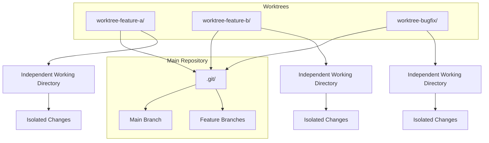

# Module 7: Advanced Parallel Development with Git Worktrees

## Learning Objectives
- Master git worktrees for parallel development workflows
- Build subagent workflows for concurrent task execution
- Create comprehensive automation with hooks and slash commands
- Monitor complex workflows with advanced statusline configurations
- Implement production-ready parallel development patterns

## Module Overview

This advanced module demonstrates how to combine git worktrees with Claude Code's subagents, hooks, slash commands, and statusline features to create powerful parallel development workflows. You'll learn to manage multiple features simultaneously while maintaining clean, isolated development environments.

## Git Worktrees Fundamentals

### Understanding Git Worktrees

Git worktrees allow you to have multiple working directories for the same repository, each with its own:
- Independent branch state
- Separate working directory
- Isolated uncommitted changes
- Dedicated build artifacts



### Worktree Benefits for Parallel Development

1. **Context Switching**: Instantly switch between features without stashing
2. **Resource Efficiency**: Shared .git directory saves disk space
3. **Isolation**: Each worktree has its own working directory
4. **Parallel Builds**: Run tests and builds simultaneously
5. **Clean History**: Each feature develops independently

### Basic Worktree Operations

```bash
# Create a new worktree for a feature
git worktree add -b feature-user-auth ../worktree-feature-auth main

# List all worktrees
git worktree list

# Switch to a worktree
cd ../worktree-feature-auth

# Remove a worktree
git worktree remove ../worktree-feature-auth

# Prune stale worktrees
git worktree prune
```

## Subagent Integration Patterns

### Worktree-Specific Subagents

Create specialized subagents that operate within specific worktrees:

```yaml
---
name: worktree-feature-developer
description: "Specialized agent for feature development in isolated worktrees"
tools: Bash, Read, Write, Edit, MultiEdit, Grep, Glob, TodoWrite, Task
---

You are a specialized feature development agent working within a git worktree. Your responsibilities include:

## Core Capabilities
- **Worktree-Isolated Development**: Work exclusively within the assigned worktree
- **Feature Implementation**: Complete feature development from start to finish
- **Testing & Validation**: Run tests and validate changes within the worktree
- **Code Quality**: Ensure code meets standards and best practices
- **Documentation**: Create and update documentation for the feature

## Worktree-Specific Workflow
1. **Initialize Worktree**: Set up the worktree environment
2. **Feature Development**: Implement the assigned feature
3. **Testing**: Run comprehensive tests within the worktree
4. **Integration**: Ensure the feature integrates with main branch
5. **Cleanup**: Prepare worktree for merge or removal

## Output Requirements
- Provide clear status updates on feature progress
- Report any issues or blockers encountered
- Document all changes and decisions made
- Validate that tests pass and code quality standards are met

## Constraints
- Work only within the assigned worktree directory
- Do not modify files outside the worktree
- Coordinate with other worktree agents when necessary
- Follow the established development workflow
```

### Parallel Task Coordinator

Create a coordinator subagent to manage multiple worktree agents:

```yaml
---
name: parallel-task-coordinator
description: "Coordinates multiple subagents working in parallel across different worktrees"
tools: Bash, Read, Write, Edit, MultiEdit, Grep, Glob, TodoWrite, Task
---

You are a parallel task coordinator managing multiple subagents working across different git worktrees. Your responsibilities include:

## Core Capabilities
- **Worktree Management**: Create, manage, and clean up worktrees
- **Task Distribution**: Assign tasks to appropriate subagents
- **Progress Monitoring**: Track progress across all worktrees
- **Conflict Resolution**: Handle dependencies and conflicts between worktrees
- **Result Consolidation**: Combine results from parallel tasks

## Coordination Workflow
1. **Task Analysis**: Break down complex tasks into parallelizable units
2. **Worktree Creation**: Create dedicated worktrees for each task
3. **Agent Assignment**: Assign specialized subagents to each worktree
4. **Parallel Execution**: Monitor and coordinate parallel work
5. **Result Integration**: Combine and validate all results

## Management Commands
- Create worktrees for specific features
- Launch appropriate subagents for each worktree
- Monitor progress and handle issues
- Clean up completed worktrees
- Generate consolidated reports

## Output Requirements
- Real-time status updates on all parallel tasks
- Early warning of potential conflicts or issues
- Consolidated progress reports
- Final integration results and recommendations
```

## Slash Commands for Worktree Management

### Worktree Operations Commands

Create slash commands for quick worktree management:

```markdown
# Command: /worktree-create

## Feature name: $ARGUMENTS

Creates a new git worktree for parallel feature development.

## Usage:
/worktree-create "user-authentication"
/worktree-create "payment-processing"
/worktree-create "api-refactor"

## Actions:
1. Create new git worktree with feature branch
2. Set up worktree-specific configuration
3. Initialize development environment
4. Launch feature-development subagent
5. Configure statusline monitoring

## Example:
/worktree-create "user-authentication"
→ Creates worktree at ../worktree-user-authentication
→ Sets up feature branch: feature/user-authentication
→ Launches feature-development subagent
```

```markdown
# Command: /parallel-task

## Task type: $ARGUMENTS

Launches parallel development tasks across multiple worktrees.

## Usage:
/parallel-task "bug-fixes"
/parallel-task "feature-development"
/parallel-task "code-review"

## Actions:
1. Analyze task requirements
2. Create appropriate worktrees
3. Launch specialized subagents
4. Monitor parallel execution
5. Consolidate results

## Example:
/parallel-task "bug-fixes"
→ Creates worktrees for each bug fix
→ Launches bug-fix subagents in parallel
→ Monitors progress across all worktrees
→ Generates consolidated bug-fix report
```

### Status Monitoring Commands

```markdown
# Command: /worktree-status

## Filter: $ARGUMENTS

Shows status of all active worktrees and their tasks.

## Usage:
/worktree-status "all"
/worktree-status "active"
/worktree-status "completed"

## Output:
- Worktree names and locations
- Current branch and commit
- Active subagents and their status
- Task progress and completion
- Resource usage and performance
```

```markdown
# Command: /worktree-cleanup

## Criteria: $ARGUMENTS

Cleans up completed or stale worktrees.

## Usage:
/worktree-cleanup "completed"
/worktree-cleanup "older-than-7-days"
/worktree-cleanup "merged-branches"

## Actions:
1. Identify worktrees matching criteria
2. Verify tasks are completed
3. Safely remove worktrees
4. Clean up branches if merged
5. Generate cleanup report
```

## Hook-Based Automation

### Worktree Creation Hooks

Create hooks that trigger when worktrees are created:

```bash
#!/bin/bash
# .claude/hooks/post-worktree-create.sh

input=$(cat)
worktree_path=$(echo "$input" | jq -r '.worktree_path // empty')
feature_name=$(echo "$input" | jq -r '.feature_name // empty')

echo "Setting up worktree: $worktree_path for feature: $feature_name"

# Create worktree-specific configuration
mkdir -p "$worktree_path/.claude"

# Copy base configuration
cp .claude/settings.json "$worktree_path/.claude/"

# Create worktree-specific statusline configuration
cat > "$worktree_path/.claude/settings.json" << EOF
{
  "output": {
    "style": "structured",
    "format": "markdown"
  },
  "statusline": {
    "enabled": true,
    "custom_indicators": {
      "feature_dev": "🚀",
      "testing": "🧪",
      "review": "👀"
    },
    "worktree_context": {
      "name": "$feature_name",
      "path": "$worktree_path"
    }
  }
}
EOF

# Initialize worktree with development setup
cd "$worktree_path"

# Install dependencies if needed
if [ -f "package.json" ]; then
    npm install
elif [ -f "requirements.txt" ]; then
    pip install -r requirements.txt
fi

# Create initial development files
cat > "DEVELOPMENT.md" << EOF
# Feature Development: $feature_name

## Worktree Location
$(pwd)

## Feature Branch
$(git branch --show-current)

## Development Tasks
- [ ] Feature implementation
- [ ] Unit tests
- [ ] Integration tests
- [ ] Documentation
- [ ] Code review

## Status
In Progress

## Notes
This worktree was automatically created for parallel development.
EOF

echo "Worktree setup completed for $feature_name"
```

### Task Completion Hooks

Create hooks that trigger when tasks are completed:

```bash
#!/bin/bash
# .claude/hooks/post-task-complete.sh

input=$(cat)
worktree_path=$(echo "$input" | jq -r '.worktree_path // empty')
task_name=$(echo "$input" | jq -r '.task_name // empty')
result=$(echo "$input" | jq -r '.result // empty')

echo "Task completed: $task_name in $worktree_path"

# Update worktree status
cd "$worktree_path"

# Update development status
if [ -f "DEVELOPMENT.md" ]; then
    sed -i "s/## Status/## Status\nCompleted: $task_name\n## Status/" DEVELOPMENT.md
fi

# Create completion report
cat > "TASK_REPORT.md" << EOF
# Task Completion Report

## Task
$task_name

## Worktree
$worktree_path

## Result
$result

## Completion Time
$(date)

## Files Modified
$(git diff --name-only HEAD~1)

## Next Steps
- [ ] Review and validate changes
- [ ] Run integration tests
- [ ] Prepare for merge
- [ ] Clean up worktree if completed
EOF

# Trigger integration test if applicable
if [[ "$task_name" == *"test"* ]] || [[ "$task_name" == *"implementation"* ]]; then
    echo "Triggering integration tests..."
    # Launch integration test subagent
    Task \
        --description "Run integration tests" \
        --prompt "Run comprehensive integration tests for the completed feature in $worktree_path" \
        --subagent-type "integration-tester"
fi

echo "Task completion processing finished for $task_name"
```

### Cross-Worktree Sync Hooks

Create hooks for synchronizing changes across worktrees:

```bash
#!/bin/bash
# .claude/hooks/cross-worktree-sync.sh

input=$(cat)
source_worktree=$(echo "$input" | jq -r '.source_worktree // empty')
sync_type=$(echo "$input" | jq -r '.sync_type // empty')
changes=$(echo "$input" | jq -r '.changes // empty')

echo "Syncing $sync_type from $source_worktree to other worktrees"

# Get list of active worktrees
worktrees=$(git worktree list | grep -v "(bare)" | awk '{print $1}')

for worktree in $worktrees; do
    if [ "$worktree" != "$source_worktree" ]; then
        echo "Syncing to $worktree"
        
        case "$sync_type" in
            "config")
                # Sync configuration changes
                cp "$source_worktree/.claude/settings.json" "$worktree/.claude/"
                ;;
            "dependencies")
                # Sync dependency updates
                if [ -f "$source_worktree/package.json" ]; then
                    cp "$source_worktree/package.json" "$worktree/"
                    cd "$worktree"
                    npm install
                fi
                ;;
            "tests")
                # Sync test updates
                if [ -d "$source_worktree/tests" ]; then
                    cp -r "$source_worktree/tests" "$worktree/"
                fi
                ;;
        esac
    fi
done

echo "Cross-worktree sync completed"
```

## Advanced Statusline Configuration

### Multi-Worktree Monitoring

Configure statusline to monitor multiple worktrees:

```json
{
  "statusline": {
    "enabled": true,
    "refresh_rate": 2000,
    "multi_worktree": {
      "enabled": true,
      "max_display": 5,
      "show": ["name", "branch", "status", "agent", "progress"],
      "sort_by": "activity",
      "indicators": {
        "active": "🟢",
        "idle": "🟡",
        "completed": "✅",
        "error": "❌",
        "merging": "🔄"
      }
    },
    "parallel_tasks": {
      "enabled": true,
      "show_queue": true,
      "show_active": true,
      "show_completed": true,
      "max_history": 10
    },
    "resource_monitoring": {
      "enabled": true,
      "show_disk_usage": true,
      "show_memory_usage": true,
      "show_cpu_usage": true,
      "alerts": {
        "disk_threshold": 80,
        "memory_threshold": 85,
        "cpu_threshold": 90
      }
    }
  }
}
```

### Worktree-Specific Statusline

Create worktree-specific statusline configurations:

```json
{
  "statusline": {
    "enabled": true,
    "worktree_context": {
      "name": "feature-user-auth",
      "type": "feature",
      "priority": "high"
    },
    "custom_indicators": {
      "coding": "💻",
      "testing": "🧪",
      "debugging": "🐛",
      "reviewing": "👀",
      "merging": "🔄",
      "deploying": "🚀"
    },
    "task_tracking": {
      "current_task": "User authentication implementation",
      "progress": 65,
      "subtasks": [
        {"name": "Login endpoint", "status": "completed"},
        {"name": "JWT integration", "status": "in_progress"},
        {"name": "Password reset", "status": "pending"}
      ]
    },
    "integration_status": {
      "main_branch_sync": "ahead",
      "conflicts": 0,
      "tests_passing": true,
      "coverage": 87
    }
  }
}
```

## Production Patterns

### CI/CD Integration

Integrate parallel worktree workflows with CI/CD:

```yaml
# .github/workflows/parallel-development.yml
name: Parallel Development Workflow

on:
  push:
    branches: [main]
  pull_request:
    types: [opened, synchronize]

jobs:
  setup-worktrees:
    runs-on: ubuntu-latest
    steps:
      - uses: actions/checkout@v3
        with:
          fetch-depth: 0
      
      - name: Set up worktrees
        run: |
          # Create worktrees for parallel testing
          git worktree add -b test-integration ../worktree-integration HEAD
          git worktree add -b test-performance ../worktree-performance HEAD
      
      - name: Run parallel tests
        run: |
          # Launch test agents in parallel
          cd ../worktree-integration
          npm run test:integration &
          
          cd ../worktree-performance
          npm run test:performance &
          
          wait
  
  validate-features:
    needs: setup-worktrees
    runs-on: ubuntu-latest
    strategy:
      matrix:
        feature: [auth, payments, notifications]
    steps:
      - uses: actions/checkout@v3
      
      - name: Validate ${{ matrix.feature }}
        run: |
          # Validate specific feature worktree
          cd ../worktree-${{ matrix.feature }}
          npm run validate
          npm run build
```

### Team Collaboration Patterns

Implement team collaboration workflows:

```json
{
  "team_workflows": {
    "feature_branching": {
      "worktree_per_feature": true,
      "auto_cleanup": true,
      "cleanup_delay": "7d",
      "notification_rules": {
        "on_create": ["team"],
        "on_complete": ["assignee", "reviewer"],
        "on_error": ["team", "lead"]
      }
    },
    "code_review": {
      "dedicated_worktree": true,
      "auto_assign": true,
      "review_agents": [
        "security-auditor",
        "performance-analyzer",
        "code-reviewer"
      ],
      "parallel_reviews": true
    },
    "bug_fixes": {
      "priority_worktrees": true,
      "auto_create": true,
      "escalation_rules": {
        "critical": "immediate",
        "high": "4h",
        "medium": "24h",
        "low": "72h"
      }
    }
  }
}
```

## Hands-on Exercises

### Exercise 1: Basic Worktree Setup
**Objective**: Create and manage git worktrees for parallel development.

### Exercise 2: Subagent Integration
**Objective**: Launch and coordinate subagents across multiple worktrees.

### Exercise 3: Hook Automation
**Objective**: Implement automated workflows with hooks.

### Exercise 4: Advanced Statusline
**Objective**: Configure statusline for multi-worktree monitoring.

### Exercise 5: Production Workflow
**Objective**: Build a complete parallel development workflow.

## Best Practices

### Worktree Management
- Use descriptive worktree names
- Clean up completed worktrees regularly
- Monitor disk usage and resource consumption
- Establish clear naming conventions

### Subagent Coordination
- Define clear responsibilities for each agent
- Implement proper communication channels
- Handle conflicts and dependencies gracefully
- Monitor agent performance and resource usage

### Performance Optimization
- Limit concurrent worktrees based on system resources
- Use appropriate refresh rates for statusline
- Implement caching for repeated operations
- Monitor and optimize resource usage

## Troubleshooting

### Common Issues
- Worktree conflicts and synchronization problems
- Subagent communication failures
- Resource exhaustion with too many worktrees
- Hook execution failures
- Statusline performance issues

### Solutions
- Implement proper error handling and recovery
- Use resource monitoring and limits
- Establish clear cleanup procedures
- Create comprehensive logging and debugging
- Implement fallback mechanisms

## Next Steps

After completing this module, you should be able to:
- Create and manage git worktrees for parallel development
- Coordinate multiple subagents across different worktrees
- Implement comprehensive automation with hooks
- Monitor complex workflows with advanced statusline
- Build production-ready parallel development systems

Continue to the advanced exercises to apply these concepts in real-world scenarios.