# Module 7: Integration and Real-world Scenarios

## Learning Objectives
- Integrate multiple Claude Code features in comprehensive workflows
- Apply learned concepts to real-world development scenarios
- Evaluate architectural decisions and trade-offs
- Implement production-ready solutions with Claude Code
- Master context engineering for complex applications

## Integration Overview

### The Complete Claude Code Stack
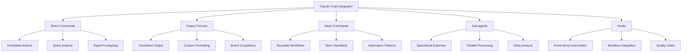

### Integration Patterns
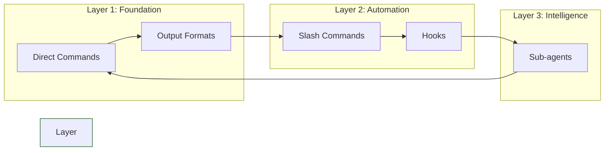

## Real-world Scenario 1: Recipe Application Development

### Complete Development Workflow
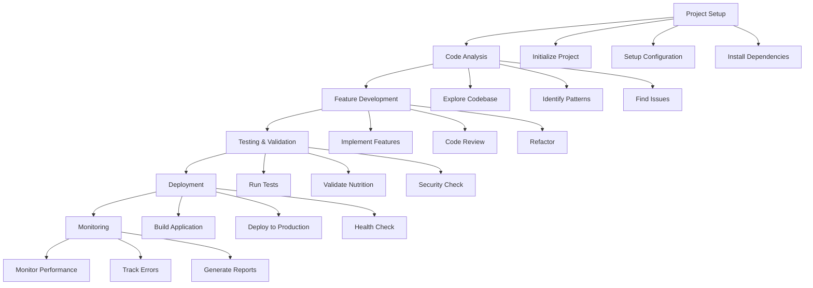

### Integrated Feature Development Example
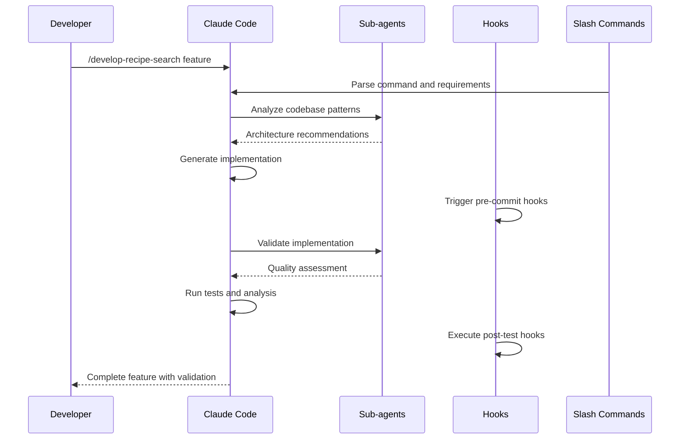

## Real-world Scenario 2: Production Deployment Pipeline

### CI/CD Integration with Claude Code
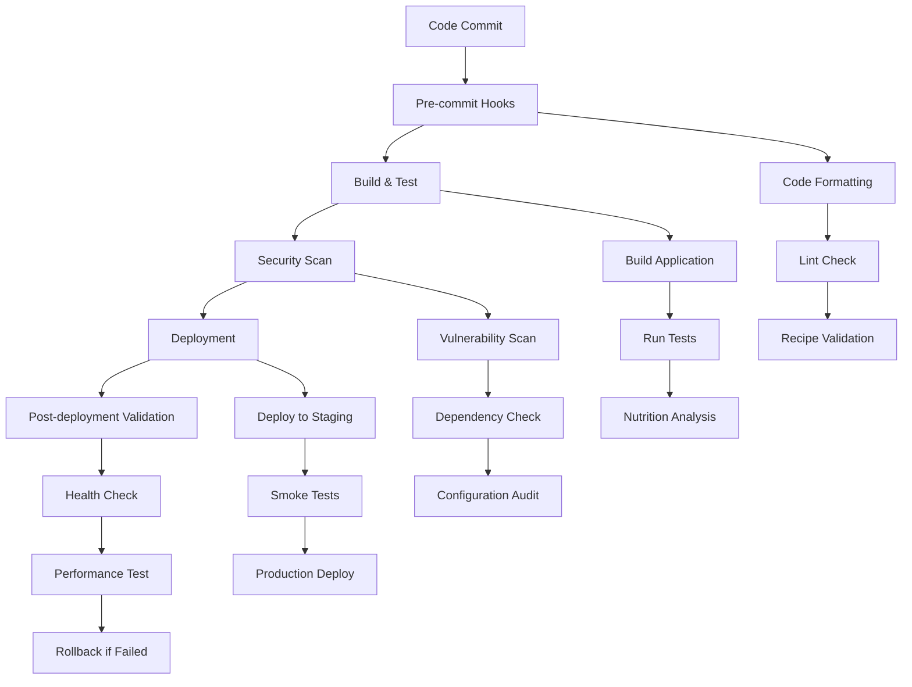

### Deployment Safety Net
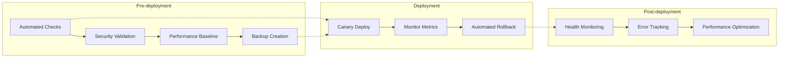

## Real-world Scenario 3: Multi-team Collaboration

### Team Integration Patterns
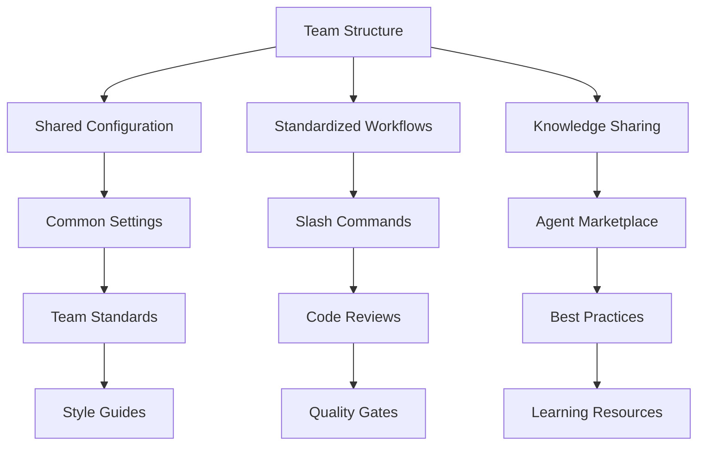

### Cross-team Workflow
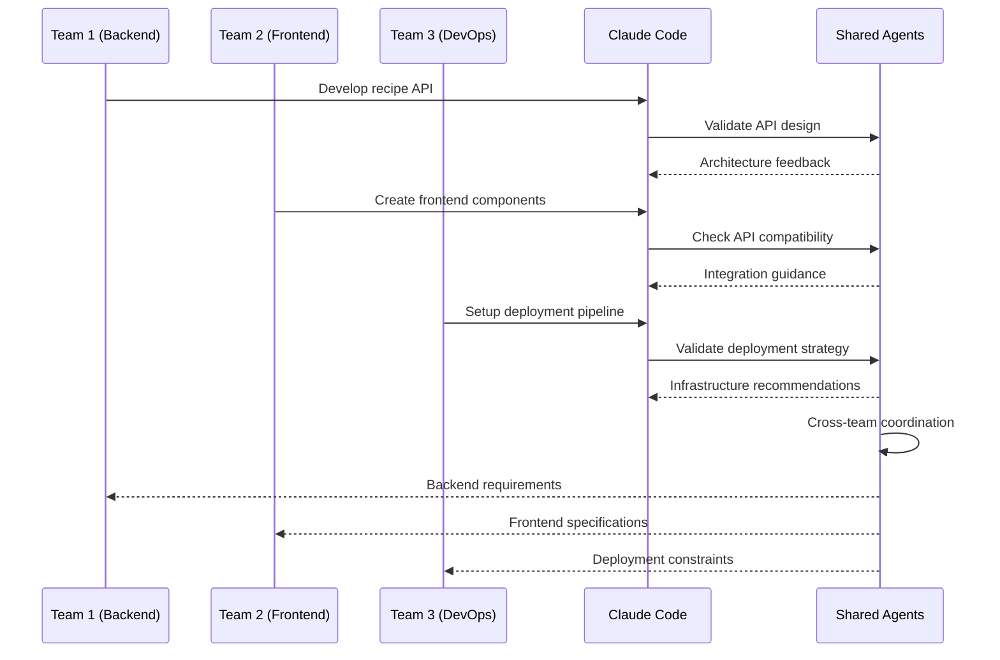

## Advanced Integration Patterns

### Context Engineering at Scale
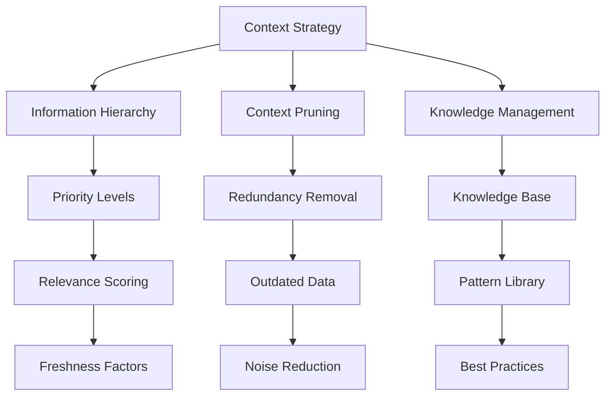

### Performance Optimization Strategies
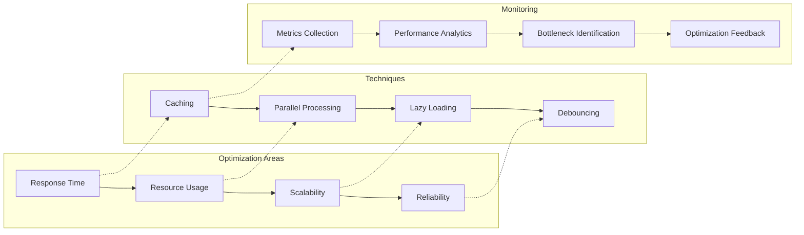

## Production Best Practices

### 1. Configuration Management
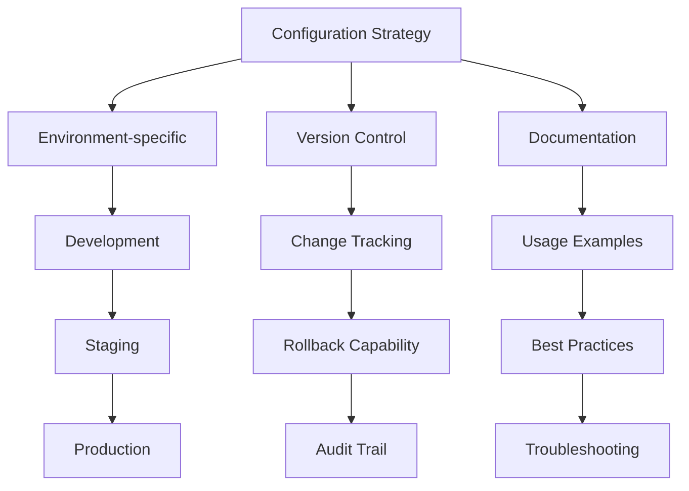

### 2. Error Handling and Recovery
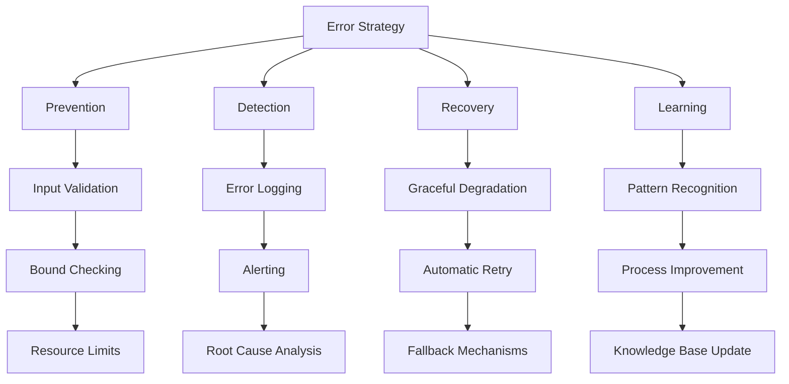

### 3. Security Considerations
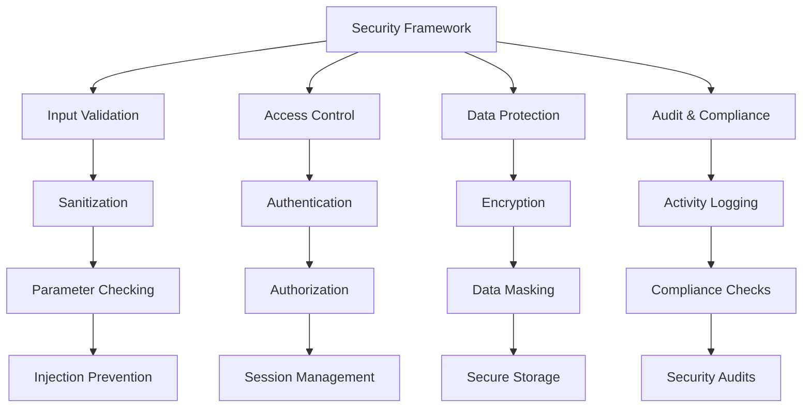

## Hands-on Integration Exercises

### Exercise 1: Complete Development Workflow
**Objective**: Implement a full development workflow using all Claude Code features.

**Tasks**:
1. **Setup integrated environment**
```
"Configure Claude Code with output formats, slash commands, sub-agents, and hooks for recipe development"
```

2. **Implement feature end-to-end**
```
"Develop a new recipe feature using the complete stack: analysis → implementation → validation → deployment"
```

3. **Optimize for production**
```
"Apply performance optimizations, security hardening, and monitoring to the implemented feature"
```

### Exercise 2: Multi-agent Orchestration
**Objective**: Coordinate multiple sub-agents for complex analysis.

**Tasks**:
1. **Design agent ecosystem**
```
"Create a set of specialized agents for recipe analysis, security, validation, and deployment"
```

2. **Implement coordination logic**
```
"Build orchestration logic that manages agent communication, conflict resolution, and result aggregation"
```

3. **Test at scale**
```
"Test the multi-agent system with complex recipes and large datasets to validate performance and accuracy"
```

### Exercise 3: Production Deployment Pipeline
**Objective**: Create a production-ready deployment pipeline.

**Tasks**:
1. **Build CI/CD integration**
```
"Integrate Claude Code hooks and agents into a CI/CD pipeline for automated testing and deployment"
```

2. **Implement safety mechanisms**
```
"Add automated rollback, health monitoring, and performance tracking to the deployment process"
```

3. **Validate production readiness**
```
"Test the complete pipeline with staging environment and production-like conditions"
```

## Case Studies

### Case Study 1: Recipe Platform Scale-up
**Challenge**: Scale recipe platform from 100 to 10,000+ recipes with maintained quality.

**Solution**:
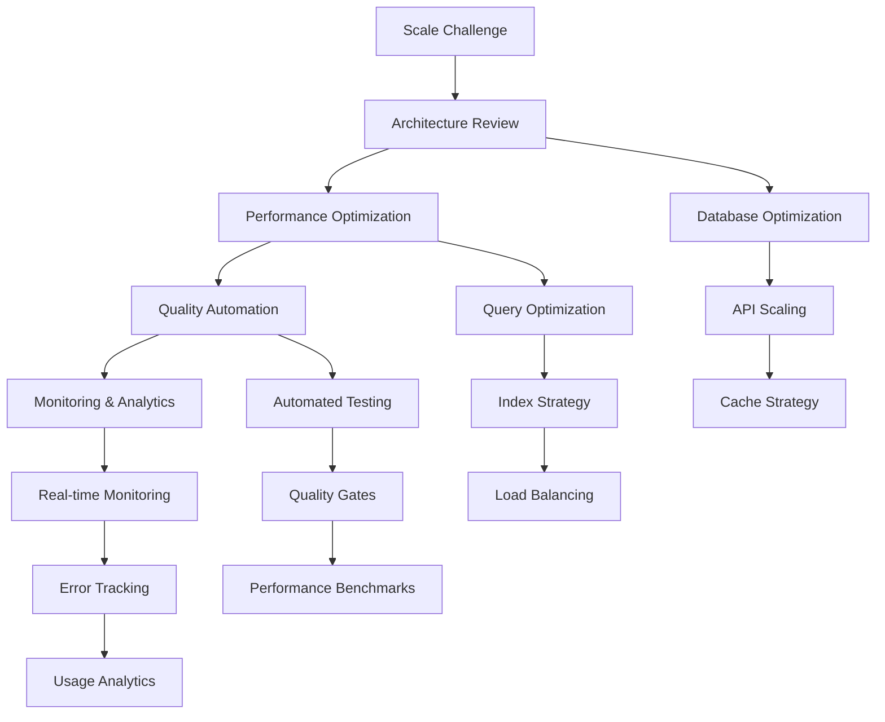

**Results**:
- 100x scale increase with 2x performance improvement
- 95% reduction in manual quality assurance
- Real-time issue detection and resolution
- Automated deployment with 99.9% success rate

### Case Study 2: Multi-team Collaboration
**Challenge**: Coordinate frontend, backend, and DevOps teams on recipe application.

**Solution**:
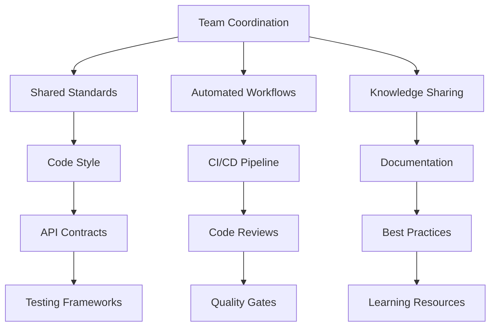

**Results**:
- 60% reduction in integration issues
- 40% faster development cycles
- Improved code quality and consistency
- Enhanced team collaboration and knowledge sharing

### Case Study 3: Production Migration
**Challenge**: Migrate recipe application from monolith to microservices.

**Solution**:
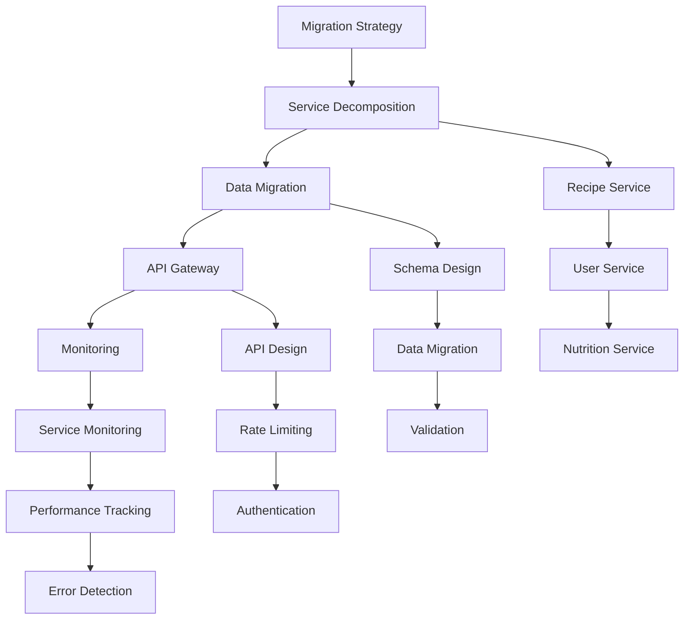

**Results**:
- Successful migration with zero downtime
- Improved scalability and maintainability
- Better fault isolation and recovery
- Enhanced development team productivity

## Evaluation and Assessment

### Success Metrics
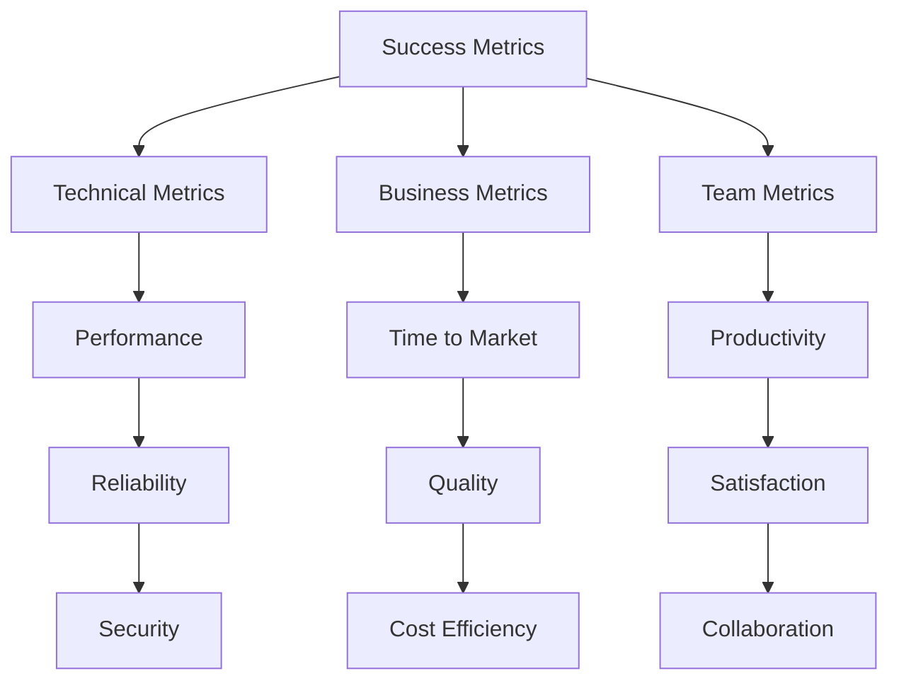

### Continuous Improvement
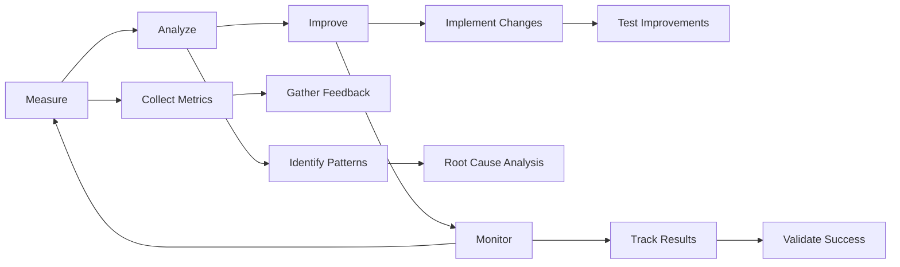

## Next Steps

After completing this module, you should be able to:
- Integrate multiple Claude Code features in comprehensive workflows
- Apply learned concepts to real-world development scenarios
- Evaluate architectural decisions and trade-offs
- Implement production-ready solutions with Claude Code
- Master context engineering for complex applications

### Workshop Completion
- Review all modules and exercises
- Complete the final integration project
- Prepare for real-world application
- Join the Claude Code community for ongoing learning

### Further Learning
- Explore advanced Claude Code features
- Contribute to the Claude Code ecosystem
- Share your experiences and best practices
- Stay updated with new features and improvements

Congratulations! You've completed the comprehensive Claude Code workshop and are ready to apply these skills to real-world development challenges.